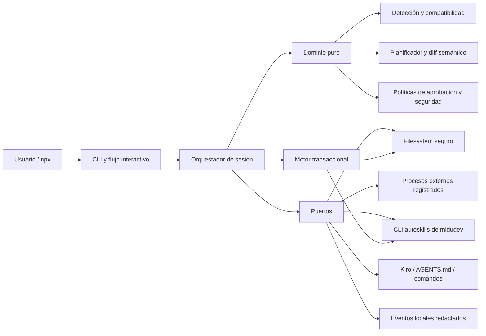
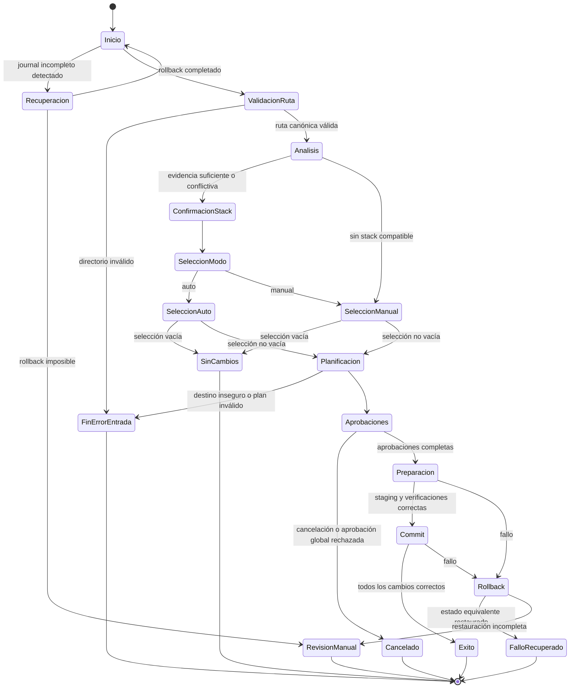
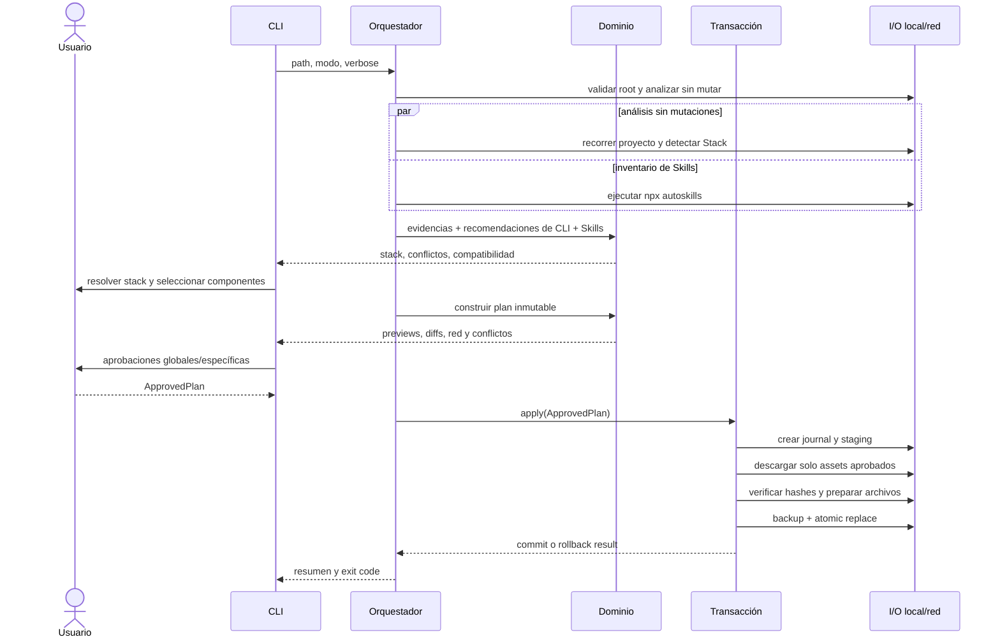

# Design Document: auto-ai-setup

> **Normative MVP scope amendment:** `scope-autoskills-tui.md` supersedes the catalog, planned Skill installation, staging, verification, rollback, ownership, idempotency, and plan-bound network design below. For the MVP, `npx autoskills` is an optional external TUI with dedicated pre-launch authorization; only changes owned by `auto-ai-setup` enter its plan and transaction.

## Overview

`auto-ai-setup` será una CLI local, interactiva y publicable en npm, escrita en TypeScript estricto y ejecutable como `npx auto-ai-setup`. El MVP convierte evidencia local y elecciones explícitas en un `Plan_de_Cambios` inmutable; ninguna mutación, instalación o descarga de una Skill comienza antes de que ese plan sea aprobado. La aplicación usa preparación en staging, journal persistente, escrituras atómicas y compensación para evitar o recuperar estados parciales. Las CLIs externas se recomiendan a partir del Stack detectado, pero el MVP no comprueba si están instaladas ni las instala automáticamente.

El diseño prioriza cuatro cualidades: (1) consentimiento verificable, (2) determinismo e idempotencia semántica, (3) seguridad por contratos tipados en vez de comandos arbitrarios y (4) separación entre lógica pura y efectos. AWS Bedrock, un backend serverless y hooks de seguridad quedan documentados como extensiones futuras, sin imports, credenciales, llamadas ni rutas de ejecución en el MVP.

### Alcance y límites del MVP

- **Runtime:** Node.js 20 LTS o superior, paquete ESM, salida compilada en `dist/`, ejecutable declarado mediante `package.json#bin` y shebang portable. `npx` ejecuta el binario publicado y pasa sus argumentos a la CLI, conforme a la [documentación oficial de npx](https://docs.npmjs.com/cli/v11/commands/npx).
- **Interfaz:** TTY interactiva; argumentos iniciales `--path`, `--mode auto|manual`, `--verbose` y `--recover`. No se diseña todavía un modo headless.
- **Agente soportado:** perfil de workspace Kiro para MCP y prompts/comandos, más `AGENTS.md` como contrato portable. Otros agentes se añaden mediante adaptadores sin cambiar el dominio.
- **Skills:** se consultan e instalan exclusivamente mediante `npx autoskills`, la CLI de midudev; el MVP no descarga ni instala directamente los archivos de una Skill.
- **MCP:** configuración de workspace en `.kiro/settings/mcp.json`; Kiro documenta configuración JSON a nivel workspace o usuario ([configuración MCP de Kiro](https://kiro.dev/docs/mcp/configuration/)). El MVP solo modifica el workspace objetivo.
- **Comandos:** prompts Markdown en `.kiro/prompts/<id>.md` acompañados por el índice estructurado `.auto-ai-setup/commands.json`; el adaptador queda alineado con la gestión de prompts reutilizables de [Kiro CLI](https://kiro.dev/docs/cli/chat/manage-prompts/).
- **Operaciones externas:** ejecución de `npx autoskills` para consultar Skills y uso del comando oficial de `autoskills` para instalar las Skills aprobadas. El MVP no ejecuta scripts de paquetes, comandos suministrados por el catálogo ni comandos arbitrarios del usuario.
- **Fuera de alcance:** telemetría remota, login, sincronización cloud, inferencia, ejecución de MCP, administración global del home del usuario, AWS Bedrock, Backend_Serverless y Hooks_de_Seguridad.

### Hallazgos de investigación y decisiones

1. La CLI oficial `autoskills` de midudev es la única vía para consultar e instalar Skills en el MVP; la herramienta no incorpora un catálogo alternativo ni descarga los archivos directamente.
2. MCP usa arquitectura cliente-servidor y servidores que exponen capacidades a aplicaciones de IA ([conceptos oficiales](https://modelcontextprotocol.io/docs/learn/server-concepts)); la CLI configura servidores, pero no los inicia ni confía automáticamente en sus herramientas.
3. Las operaciones externas permitidas usan comandos registrados, argumentos controlados, salida acotada y cancelación explícita. No se ejecutan comandos arbitrarios ni scripts de paquetes.
4. La configuración MCP de Kiro es JSON de workspace; se preservarán claves desconocidas y solo se gestionarán entradas identificadas por la herramienta.
5. Para mantener atomicidad real, toda descarga se hace a staging y se verifica antes del commit. No se admiten instalaciones con efectos irreversibles en el MVP.

## Architecture

Se adopta arquitectura hexagonal por capas. El dominio no importa APIs de terminal, filesystem, red ni procesos; la aplicación coordina casos de uso mediante puertos; los adaptadores encapsulan tecnología y formatos.


### Módulos y dirección de dependencias

| Módulo | Responsabilidad | No puede |
|---|---|---|
| `cli` | Parsear flags, verificar TTY, renderizar prompts, previews y resumen; mapear salida a código de proceso | Leer/escribir archivos o ejecutar procesos directamente |
| `application/session` | Máquina de estados de una ejecución, cancelación, composición de puertos y trazas | Decidir compatibilidad o construir diffs por sí mismo |
| `domain/project` | Clasificación nuevo/existente, evidencia, stack, conflictos y compatibilidad | Acceder al filesystem |
| `domain/catalog` | Validar las respuestas de `autoskills`, identidad/origen, filtrar y recomendar Skills | Ejecutar procesos o instalar contenido |
| `domain/planning` | Construir plan determinista, detectar conflictos, calcular aprobaciones y hash | Aplicar cambios |
| `domain/config` | Parsear, validar, fusionar y comparar modelos estructurados preservando campos | Elegir rutas fuera del adaptador |
| `domain/security` | Contención de rutas, allowlists, política de red y redacción | Aceptar strings de shell libres |
| `infrastructure/fs` | Recorrido acotado, realpath, lectura segura, staging, atomic rename y backups | Interpretar requisitos de producto |
| `infrastructure/process` | Ejecutar únicamente la invocación registrada de `npx autoskills` y sus comandos oficiales, con argumentos controlados, límites y cancelación | Ejecutar comandos arbitrarios o CLIs recomendadas automáticamente durante la detección |
| `infrastructure/catalog` | Adaptar las respuestas e instalación oficial de `autoskills` y verificar la identidad de las Skills | Incorporar fuentes alternativas o instalar archivos directamente |
| `infrastructure/agent` | Adaptadores Kiro, `AGENTS.md`, Skills y comandos | Sobrescribir campos no gestionados |
| `infrastructure/transaction` | Journal, prepare/verify/commit/rollback/recovery | Ejecutar una operación ausente del plan aprobado |
| `infrastructure/observability` | Eventos JSON internos, render humano y redacción | Transmitir datos por red |

### Flujo interactivo y máquina de estados



La sesión captura `Ctrl+C` como cancelación cooperativa. Antes de aplicar, termina con código 0 y sin persistencia. Durante prepare/commit intenta rollback; si no puede demostrar estado equivalente, conserva el journal, enumera rutas y termina con código 3. Los estados terminales asignan: éxito/cancelación `0`, fallo de aplicación recuperado `1`, entrada/configuración/seguridad inválida `2`, ejecución incompleta o recuperación fallida `3`.

### Secuencia de planificación y aplicación



## Components and Interfaces

Las firmas siguientes son contratos de diseño; los tipos de error son discriminated unions y no excepciones sin clasificar en los límites del dominio.

```ts
type Result<T, E extends AppError> =
  | { ok: true; value: T }
  | { ok: false; error: E };

type RunMode = "auto" | "manual";
type ExitCode = 0 | 1 | 2 | 3;

interface SessionOrchestrator {
  run(input: SessionInput, ui: UserInteraction): Promise<ExecutionSummary>;
}

interface UserInteraction {
  chooseTarget(initial?: string): Promise<string>;
  resolveStack(conflicts: StackConflict[]): Promise<ConfirmedStack>;
  chooseMode(initial?: string): Promise<RunMode>;
  selectComponents(view: ComponentSelectionView): Promise<ComponentId[]>;
  reviewPlan(plan: ChangePlan): Promise<ApprovalDecisions>;
  render(event: RedactedEvent): void;
}
```

### Proyecto y detección basada en evidencia

```ts
interface ProjectGateway {
  validateDirectory(path: string): Promise<Result<ValidatedProject, DirectoryError>>;
  inventory(root: CanonicalPath, policy: ScanPolicy): AsyncIterable<FileDescriptor>;
  readRecognized(path: SafeProjectPath, limit: ByteCount): Promise<Uint8Array>;
}

interface StackDetector {
  readonly id: string;
  readonly acceptedFiles: readonly FilePattern[];
  detect(file: ParsedEvidence): readonly DetectionClaim[];
}

interface StackAnalyzer {
  analyze(files: AsyncIterable<FileDescriptor>): Promise<Result<StackAnalysis, EvidenceError>>;
}
```

El registro de detectores es declarativo y versionado. Cada `DetectionClaim` incluye categoría, valor normalizado, confianza, ruta, selector/ubicación y dato reconocido. JSON, TOML o YAML se parsean con parser seguro y esquema; nunca se extraen valores de archivos sintácticamente inválidos. El MVP reconoce:

- lenguajes por manifiestos/configuración y extensiones: JavaScript/TypeScript, Python, Ruby y PHP;
- gestores por lockfiles/manifiestos: npm, pnpm, Yarn, Bun, pip/Poetry/uv, Bundler y Composer;
- frameworks por dependencias/configuración: React, Next.js, Vue, Svelte, Express, NestJS, Django, FastAPI, Rails y Laravel;
- herramientas por configuración/dependencias: Vitest, Jest, Playwright, ESLint, Prettier, Tailwind, Prisma, Supabase, Vercel y GitHub Actions.

Los detectores no infieren por nombre de carpeta. Un valor de manifiesto explícito tiene prioridad sobre heurísticas por extensión, pero toda evidencia se conserva. Las categorías declaran cardinalidad y reglas de exclusión: varios lenguajes/frameworks pueden coexistir; lockfiles incompatibles para el gestor raíz generan conflicto. Recomendaciones que dependan de una categoría conflictiva se suspenden hasta la resolución explícita.

El recorrido es iterativo, no sigue symlinks, prioriza archivos reconocidos y excluye al menos `node_modules`, `.pnpm`, `.yarn/cache`, `vendor`, `.venv`, `venv`, `.git`, `.hg`, `.svn`, `dist`, `build`, `out`, `.next`, `coverage` y `.nyc_output`. Los límites por archivo y el conteo por extensión evitan cargar código completo en memoria.
### Recomendación de CLIs y gestión de Skills mediante autoskills

```ts
type InitialCli = "gh" | "supabase" | "vercel" | "playwright";

interface CliRecommendation {
  cli: InitialCli;
  reason: string;
  evidenceRefs: readonly string[];
}

interface AutoSkillsGateway {
  list(): Promise<Result<CatalogSnapshot, CatalogError>>;
  install(entry: SkillCatalogEntry, approval: ExternalOperationApproval, target: SafeProjectPath):
    Promise<Result<InstalledArtifact, InstallationError>>;
}

interface RecommendationEngine {
  recommendClis(stack: ConfirmedStack): readonly CliRecommendation[];
  recommend(input: RecommendationInput): readonly Recommendation[];
  explain(component: ComponentDefinition, input: CompatibilityInput): CompatibilityDecision;
}
```

Las recomendaciones de CLIs son decisiones puras basadas en evidencias del Stack. El MVP recomienda `supabase` para proyectos con Supabase, `gh` para proyectos con GitHub o GitHub Actions, `vercel` para proyectos con Vercel y `playwright` para proyectos con Playwright. No comprueba si esas CLIs están instaladas, no consulta sus versiones y no las instala automáticamente.

Para las Skills, el adaptador ejecuta `npx autoskills` para obtener el inventario y utiliza el comando oficial de instalación de esa CLI para las Skills aprobadas. No se descargan archivos directamente desde URLs construidas por `auto-ai-setup` ni se aceptan fuentes alternativas. La identidad y el origen de la Skill instalada deben coincidir con la entrada presentada por `autoskills`; cualquier fallo excluye Skills, elimina artefactos parciales y activa la recuperación transaccional.

La recomendación de componentes es una función pura: compatibilidad declarativa (`allOf`, `anyOf`, `noneOf`) sobre el Stack confirmado y las Recomendaciones_de_CLI relacionadas, seguida de orden estable por tipo, prioridad e ID. No hay inferencia remota. En automático se muestran explicación y evidencia y se permite retirar cualquier resultado; en manual se muestra todo por tipo, incluyendo incompatibles con su razón. Incluir manualmente un incompatible requiere confirmación específica y queda marcado en el plan.

### Adaptadores de componentes y configuración

```ts
interface ComponentAdapter<D extends ComponentDefinition = ComponentDefinition> {
  supports(component: D): boolean;
  inspect(ctx: InspectionContext, component: D): Promise<CurrentComponentState>;
  propose(ctx: PlanningContext, component: D): Promise<readonly ProposedOperation[]>;
  verify(ctx: VerificationContext, operation: ProposedOperation): Promise<Result<void, AppError>>;
}

interface StructuredConfigCodec<T extends JsonObject> {
  parse(source: SourceDocument): Result<ParsedConfig<T>, ConfigError>;
  validate(model: T): Result<T, ConfigError>;
  merge(model: T, patch: ManagedPatch): Result<T, ConfigError>;
  serialize(model: T, style: DocumentStyle): Result<string, ConfigError>;
  equivalent(a: T, b: T): boolean;
}
```

- **Skills:** destino `.kiro/skills/<skill-id>/`; manifiesto de propiedad en `.auto-ai-setup/state.json`. No se borra contenido no registrado como propiedad de la herramienta.
- **MCP:** merge por ID en `.kiro/settings/mcp.json#mcpServers`. Se aceptan `command`, `args`, nombres de variables `env` y opciones documentadas; el plan nunca contiene valores secretos. Entradas ajenas y campos desconocidos se preservan. No se inicia el servidor.
- **Reglas:** bloques delimitados en `AGENTS.md` con marcadores `<!-- auto-ai-setup:rule:<id>:begin -->` y `:end -->`. La equivalencia normaliza finales de línea y espacios finales, no el contenido fuera del bloque. Marcadores corruptos son conflicto, nunca reemplazo implícito.
- **Comandos:** contenido en `.kiro/prompts/<id>.md` y metadatos en `.auto-ai-setup/commands.json`. El índice JSON es la configuración estructurada trazable; modificar un comando preserva otros comandos y campos desconocidos.
- **Estado gestionado:** `.auto-ai-setup/state.json` registra versión de esquema, componentes, origen/digest, destinos y último run exitoso. Es ayuda para ownership e idempotencia, no autoridad suficiente: siempre se contrasta con el estado real.

JSON es el único formato estructurado que el MVP escribe. Se rechazan claves peligrosas (`__proto__`, `prototype`, `constructor`), duplicadas cuando el parser pueda reportarlas, valores no representables y esquemas inválidos. El parser produce ubicación por JSON Pointer y línea/columna. El merge es copy-on-write; el serializer conserva indentación y EOL cuando se detectan, usa newline final y no reordena el archivo salvo claves nuevas dentro del objeto gestionado. La equivalencia usa normalización profunda de orden de claves sin normalizar arrays.

### Planificación y aprobación

```ts
interface ChangePlanner {
  build(input: PlanningInput): Promise<Result<ChangePlan, PlanningError>>;
}

interface ApprovalPolicy {
  evaluate(plan: ChangePlan, decisions: ApprovalDecisions): Result<ApprovedPlan, ApprovalError>;
}

interface PathPolicy {
  resolveDestination(root: CanonicalPath, requested: ProjectRelativePath):
    Promise<Result<SafeProjectPath, UnsafePathError>>;
}
```

El plan se ordena por destino, tipo de operación e ID y recibe `planHash = SHA-256(canonicalPlanWithoutApprovals)`. Contiene estado `create|modify|preserve|install|skip`, componente, motivo, conflicto, previews redactadas y operaciones externas con origen/destino/propósito/red. Para JSON se presenta diff campo a campo; para texto, preview acotada. Una operación semánticamente equivalente es `preserve`, no mutación.

Las decisiones se vinculan a `planHash`: confirmación global si no hay conflictos, decisión `preserve|replace` por archivo conflictivo y confirmación específica por componente incompatible. Cada operación de red tiene un ID estable y aprobación explícita; una aprobación global no amplía el conjunto de redes si la UI no las enumeró. Tras aprobar se crea un `ApprovedPlan` inmutable que elimina operaciones omitidas. Si el estado observado cambia entre planificación y aplicación, los precondition hashes fallan y se exige replanificar.

`PathPolicy` exige paths relativos normalizados, rechaza rutas absolutas, `..`, dispositivos y NUL, comprueba contención léxica y real, y recorre cada ancestro existente con `lstat/realpath` para impedir escapes por symlink. Los nuevos destinos heredan la identidad canónica del ancestro existente más cercano.

### Aplicación transaccional y recuperación

```ts
interface TransactionEngine {
  apply(plan: ApprovedPlan, signal: AbortSignal): Promise<TransactionResult>;
  recover(journal: RecoveryJournal): Promise<RecoveryResult>;
}

interface TransactionOperation {
  prepare(ctx: TxContext): Promise<Result<PreparedOperation, AppError>>;
  verify(prepared: PreparedOperation): Promise<Result<void, AppError>>;
  commit(prepared: PreparedOperation): Promise<Result<CommitReceipt, AppError>>;
  rollback(receipt: CommitReceipt): Promise<Result<void, AppError>>;
}
```

El journal vive en `.auto-ai-setup/transactions/<runId>/journal.json` y se actualiza mediante write-fsync-rename. Fases:

1. **Prepare:** crear staging, volver a validar plan/aprobaciones/rutas/precondiciones, ejecutar únicamente las operaciones aprobadas de `autoskills`, generar archivos finales y verificar esquemas. Todavía no se modifica ningún archivo de usuario.
2. **Commit:** por orden determinista, copiar cada archivo existente a backup con digest y metadatos; registrar inexistencia; escribir temporal sibling, `fsync` y renombrar atómicamente. Cada paso se registra antes y después.
3. **Finalize:** verificar estado deseado, escribir estado gestionado, marcar `committed`, eliminar backups/staging y emitir resumen.
4. **Rollback:** en orden inverso, restaurar backups y eliminar archivos que no existían; limpiar artefactos staged/creados; comparar digests y existencia con el snapshot inicial. Éxito demostrable produce código 1; discrepancia conserva journal y produce código 3.

Las instalaciones mediante `autoskills` no deben dejar efectos persistentes antes del commit y sus temporales pertenecen a la transacción. El MVP no admite operaciones externas sin estrategia `prepare/verify/rollback`; en particular no ejecuta `npm install`, lifecycle scripts ni comandos arbitrarios. Al iniciar, un journal no terminal bloquea una ejecución nueva y ofrece recuperación; `--recover` la solicita directamente. Se intenta rollback en señales controlables, pero un kill/crash puede requerir la siguiente ejecución.

### Observabilidad, seguridad y rendimiento

Cada ejecución usa `crypto.randomUUID()`. `EventSink` recibe `{runId,timestamp,level,category,message,context}` y, en el MVP, solo renderiza terminal; `--verbose` agrega evidencias y decisiones. La redacción ocurre antes de cualquier sink y recorre strings/objetos por claves sensibles, patrones de tokens/PEM/URLs con credenciales y valores secretos conocidos; sustituye el valor completo por `[REDACTED]`. Se omiten cuerpos descargados, contenido completo de env y stdout potencialmente sensible de logs normales. No existe telemetría.

La red se niega por defecto. Solo las operaciones de `autoskills` enumeradas y aprobadas pueden utilizar red, con aprobación coincidente con `planHash`, Skill, destino y propósito. El análisis, prompts y logs no usan red. Los procesos se crean desde un registro cerrado; no hay `eval`, shell libre, concatenación de comandos ni hooks ejecutables. Las Skills se tratan como datos y nunca se ejecutan durante setup.

El analizador usa recorrido asíncrono con concurrencia acotada a 8, backpressure, lecturas dirigidas por detectores y archivos de manifiesto de máximo 2 MiB. Mantiene metadatos y evidencias, no árboles completos. Se contabilizan archivos y bytes fuera de exclusiones; superar 10 000 o 500 MB marca el resultado fuera del perfil sin abortar. Se miden con reloj monotónico recorrido→presentación de stack y RSS máximo muestreado. El análisis no ejecuta ni espera a las CLIs recomendadas. El objetivo verificable es ≤10 s en 9/10 corridas y ≤512 MB bajo el perfil definido.

## Data Models
```ts
type CanonicalPath = string & { readonly __brand: "CanonicalPath" };
type SafeProjectPath = string & { readonly __brand: "SafeProjectPath" };
type ComponentId = string & { readonly __brand: "ComponentId" };
type Sha256 = string & { readonly __brand: "Sha256" };

interface ValidatedProject {
  root: CanonicalPath;
  kind: "new" | "existing";
  projectFileCount: number;
  recognizedAiConfig: readonly SafeProjectPath[];
}

interface StackEvidence {
  path: SafeProjectPath;
  format: "json" | "toml" | "yaml" | "lockfile" | "source-extension";
  location: string;
  recognizedValue: string;
  detectorId: string;
}

interface StackItem {
  category: "language" | "package-manager" | "framework" | "tool";
  id: string;
  displayName: string;
  confidence: "explicit" | "derived";
  evidence: readonly StackEvidence[];
}

interface StackConflict {
  category: StackItem["category"];
  candidates: readonly StackItem[];
  blocksCapabilities: readonly string[];
}

interface StackAnalysis {
  items: readonly StackItem[];
  conflicts: readonly StackConflict[];
  analyzedFileCount: number;
  analyzedBytes: number;
  elapsedMs: number;
  withinPerformanceProfile: boolean;
}

interface CliRecommendation {
  cli: InitialCli;
  reason: string;
  evidenceRefs: readonly string[];
}
```

```ts
interface CatalogSnapshot {
  schemaVersion: 1;
  catalogId: string;
  sourceRepository: "https://github.com/midudev/autoskills";
  sourceCommit: string;
  generatedAt: string;
  entries: readonly SkillCatalogEntry[];
  manifestDigest: Sha256;
}

interface SkillCatalogEntry {
  type: "skill";
  id: ComponentId;
  name: string;
  description: string;
  origin: {
    repository: "https://github.com/midudev/autoskills";
    commit: string;
    relativePath: string;
  };
  files: readonly { relativePath: string; size: number; sha256: Sha256 }[];
  compatibility: CompatibilityExpression;
  destinationTemplate: ".kiro/skills/{id}";
}

type CompatibilityExpression =
  | { op: "stack"; category: StackItem["category"]; oneOf: readonly string[] }
  | { op: "cli"; oneOf: readonly InitialCli[] }
  | { op: "all" | "any"; clauses: readonly CompatibilityExpression[] }
  | { op: "not"; clause: CompatibilityExpression }
  | { op: "always" };

interface ComponentDefinition {
  id: ComponentId;
  type: "skill" | "mcp-server" | "agent-rule" | "agent-command";
  name: string;
  description: string;
  compatibility: CompatibilityExpression;
  source: ComponentSource;
}

interface CompatibilityDecision {
  compatible: boolean;
  satisfied: readonly string[];
  unsatisfied: readonly string[];
  evidenceRefs: readonly string[];
}
```

```ts
interface ChangePlan {
  schemaVersion: 1;
  runId: string;
  root: CanonicalPath;
  mode: RunMode;
  catalogDigest?: Sha256;
  confirmedStackDigest: Sha256;
  createdAt: string;
  fileChanges: readonly FileChange[];
  externalOperations: readonly ExternalOperation[];
  warnings: readonly PlanWarning[];
  planHash: Sha256;
}

interface FileChange {
  id: string;
  componentId: ComponentId;
  destination: SafeProjectPath;
  action: "create" | "modify" | "preserve" | "skip";
  reason: string;
  conflict: "none" | "content-differs" | "invalid-managed-markers" | "ownership-unknown";
  beforeDigest?: Sha256;
  afterDigest?: Sha256;
  preview: RedactedPreview | FieldDiff;
  incompatibleOverride?: CompatibilityDecision;
}

interface ExternalOperation {
  id: string;
  componentId: ComponentId;
  kind: "skill-install";
  command: readonly string[];
  origin: string;
  destination: SafeProjectPath;
  purpose: string;
  usesNetwork: true;
  expectedFiles: readonly { path: string; size: number; sha256: Sha256 }[];
}

interface ApprovalDecisions {
  planHash: Sha256;
  globalApproved: boolean;
  conflicts: Readonly<Record<string, "preserve" | "replace">>;
  incompatibleComponents: readonly ComponentId[];
  networkOperations: readonly string[];
}

interface ApprovedPlan extends ChangePlan {
  approval: ApprovalDecisions;
  approvedFileChangeIds: readonly string[];
  approvedExternalOperationIds: readonly string[];
}
```

```ts
interface ManagedState {
  schemaVersion: 1;
  components: Readonly<Record<string, ManagedComponent>>;
  lastSuccessfulRunId: string;
}

interface ManagedComponent {
  type: ComponentDefinition["type"];
  origin: string;
  sourceRevision?: string;
  destinations: readonly SafeProjectPath[];
  contentDigest: Sha256;
}

interface RecoveryJournal {
  schemaVersion: 1;
  runId: string;
  root: CanonicalPath;
  planHash: Sha256;
  phase: "preparing" | "prepared" | "committing" | "rolling-back" | "committed" | "rolled-back";
  entries: readonly JournalEntry[];
  manualReviewPaths: readonly SafeProjectPath[];
}

interface JournalEntry {
  operationId: string;
  destination: SafeProjectPath;
  prior: { existed: false } | { existed: true; digest: Sha256; backupPath: SafeProjectPath };
  desiredDigest: Sha256;
  status: "pending" | "backed-up" | "committed" | "restored" | "failed";
}

interface LocalEvent {
  runId: string;
  timestamp: string;
  level: "debug" | "info" | "warn" | "error";
  category: "session" | "project" | "stack" | "cli" | "catalog" | "plan" | "security" | "transaction";
  message: string;
  context?: Readonly<Record<string, unknown>>;
}

interface ExecutionSummary {
  runId: string;
  status: "success" | "cancelled" | "failed-recovered" | "incomplete" | "invalid-input";
  exitCode: ExitCode;
  applied: readonly string[];
  skipped: readonly string[];
  warnings: readonly string[];
  errors: readonly string[];
  recovery?: RecoveryResult;
  manualReviewPaths: readonly SafeProjectPath[];
  analysis?: { analyzedFileCount: number; elapsedMs: number; peakRssBytes: number; withinProfile: boolean };
}
```

### Invariantes de dominio

1. Todo `SafeProjectPath` está contenido léxica y físicamente en `ValidatedProject.root` al planificar y al aplicar.
2. `planHash` cubre todas las operaciones y metadatos relevantes; una aprobación solo es válida para ese hash.
3. `ApprovedPlan.approved*Ids` son subconjuntos de operaciones del plan y ninguna operación ejecutada queda fuera de esos conjuntos.
4. IDs de catálogo, componentes, operaciones, destinos gestionados y bloques de regla son únicos en su ámbito.
5. Un archivo `preserve|skip` nunca entra al commit; una operación equivalente no produce escritura ni proceso externo.
6. Todo archivo modificado tiene backup verificable; todo archivo creado registra inexistencia antes del commit.
7. Un journal terminal `committed|rolled-back` no se vuelve a aplicar; uno no terminal impide iniciar otra transacción.
8. Ningún evento o preview sale del redactor y ningún sink del MVP transmite por red.
9. Todo modelo estructurado conserva campos y valores no gestionados, y debe validar sintaxis y esquema antes de reemplazar el original.
10. El runtime no contiene dependencia funcional de Bedrock, backend serverless ni hooks.
## Correctness Properties

*A property is a characteristic or behavior that should hold true across all valid executions of a system-essentially, a formal statement about what the system should do. Properties serve as the bridge between human-readable specifications and machine-verifiable correctness guarantees.*

### Reflexión y consolidación

El prework identificó criterios universales en detección, planificación, configuración y recuperación. Se eliminaron redundancias así: provenance reúne categorías/rutas/datos; completitud de plan reúne sus campos y previews; autorización exacta reúne archivos, componentes, red y operaciones externas; una sola propiedad de redacción cubre previews y logs; idempotencia se divide únicamente en estado estable y unicidad; el round-trip de configuración subsume sintaxis, esquema, campos y valores; la frame property subsume la preservación de campos desconocidos. Las comprobaciones de UI, empaquetado, filesystem real, procesos, rendimiento, documentación y CI permanecen como pruebas example/integration/smoke y no se presentan falsamente como propiedades.

### Property 1: Validar un directorio no deja efectos y canoniza el root

**For all** (para todo) directorio candidato y todo punto de fallo de validación, el archivo temporal de comprobación no debe existir al terminar; si la validación falla, el snapshot persistente debe permanecer equivalente y el código debe ser 2, y si tiene éxito, el root elegido debe ser su `realpath` canónico.

**Validates: Requirements 1.6, 1.8, 1.9**

### Property 2: Clasificación total por cantidad de archivos de proyecto

**For all** (para todo) conteo entero no negativo de Archivos_de_Proyecto, el proyecto debe clasificarse como `new` si y solo si el conteo es cero, y como `existing` si y solo si es mayor que cero.

**Validates: Requirements 1.11, 1.12**

### Property 3: Toda detección válida tiene provenance completa

**For all** (para toda) colección de evidencias reconocidas con sintaxis válida, cada elemento detectado de lenguaje, gestor, framework o herramienta debe estar respaldado exclusivamente por claims que conserven ruta, ubicación y dato reconocido; ninguna evidencia con sintaxis inválida debe producir un claim y su error debe identificar ruta, ubicación y causa.

**Validates: Requirements 2.1, 2.2, 2.3, 2.4, 2.5, 2.6, 2.9, 2.10**

### Property 4: Los conflictos suspenden únicamente recomendaciones dependientes

**For all** (para todo) análisis de stack y catálogo, mientras una categoría esté en conflicto, ninguna recomendación cuya compatibilidad dependa de esa categoría debe aparecer; al resolverla explícitamente se debe reevaluar con el valor elegido, y un análisis sin stack compatible debe producir cero recomendaciones y fallback manual.

**Validates: Requirements 2.14, 2.15**

### Property 5: Clasificación de probes aislada y determinista

**For all** (para toda) combinación de resultados de las cuatro specs allowlisted, solo un código cero, salida con SemVer analizable y duración menor de 5000 ms debe producir `available`; nonzero, versión inválida o timeout afecta únicamente a su CLI, y toda CLI no disponible debe bloquear componentes que la requieran.

**Validates: Requirements 3.5, 3.6, 3.8, 3.9, 3.11, 3.14**

### Property 6: Solo existen dos modos válidos

**For all** (para todo) valor de modo, el parser debe aceptar exclusivamente `auto` o `manual`; cualquier otro valor debe producir una nueva solicitud que enumere ambos valores válidos sin generar cambios.

**Validates: Requirements 4.2, 4.3**

### Property 7: Selección automática compatible y gate de selección

**For all** (para todo) stack confirmado, conjunto de CLIs y catálogo, cada recomendación automática debe satisfacer su expresión de compatibilidad; una selección vacía no debe crear plan ni aprobación y debe resumir cero cambios/código 0, mientras una selección no vacía nunca puede alcanzar aplicación sin `ApprovedPlan`.

**Validates: Requirements 4.4, 4.8, 4.9, 4.10, 4.11, 4.12**

### Property 8: Membresía e integridad de Skills gestionadas por autoskills

**For all** (para toda) entrada de Skill aceptada, su identidad y origen deben coincidir con una entrada única devuelta por `npx autoskills` durante la ejecución; cualquier entrada externa o alterada debe rechazarse antes de invocar el comando oficial de instalación, y una respuesta inválida debe producir un inventario de Skills vacío.

**Validates: Requirements 5.1, 5.7, 5.8, 5.9, 5.10, 5.12**

### Property 9: Las vistas de componentes son completas

**For all** (para toda) definición de Skill o Servidor_MCP, su view model debe conservar nombre, descripción/propósito, origen cuando aplique y decisión de compatibilidad explicada, incluidas todas las condiciones incumplidas de stack o CLI.

**Validates: Requirements 5.2, 5.3, 5.4, 5.5, 6.2, 6.8, 6.9**

### Property 10: La proyección de componentes al plan es completa y no filtra secretos

**For all** (para todo) conjunto seleccionado, el plan debe contener exactamente la identidad, origen, destino, archivos y operaciones declaradas de sus componentes; las variables de entorno deben aparecer solo por nombre, las reglas como bloques identificables y los comandos como entradas estructuradas. Un override incompatible rechazado no aparece y uno aprobado conserva su incompatibilidad.

**Validates: Requirements 5.6, 6.3, 6.4, 6.5, 6.6, 6.7, 6.11, 6.12**

### Property 11: El diff de plan es determinista y completo

**For all** (para todo) estado actual y estado deseado equivalentes bajo la misma raíz, el plan debe ser determinista: cada destino tiene una única acción correcta `create|modify|preserve`, componente, motivo y conflicto; cada externa tiene origen/destino/propósito/red; todo texto mutable tiene preview y todo JSON mutable un diff que contiene exactamente los campos semánticamente cambiados.

**Validates: Requirements 7.3, 7.4, 7.5, 7.6, 7.7, 7.8, 7.9, 7.10**

### Property 12: Las decisiones de aprobación se vinculan al plan exacto

**For all** (para todo) plan, si no tiene conflictos debe requerir aprobación global; si tiene conflictos, el conjunto de decisiones requeridas debe coincidir exactamente con sus archivos conflictivos. `preserve` elimina la mutación y marca omisión, mientras `replace` solo es válido con aprobación específica ligada al mismo `planHash`.

**Validates: Requirements 7.11, 7.12, 7.13, 7.14, 7.15**
### Property 13: Confinamiento físico y lógico de destinos

**For all** (para toda) raíz canónica y path solicitado, `PathPolicy` debe aceptar el destino solo si todos sus ancestros existentes y el destino resuelto permanecen dentro de la raíz; rutas absolutas, traversal, dispositivos, NUL y escapes por symlink deben rechazarse antes de aplicar.

**Validates: Requirements 7.18, 7.19, 15.3**

### Property 14: La redacción es no filtrante e idempotente

**For all** (para todo) evento o preview y todo conjunto conocido de Datos_Sensibles, `redact(redact(x))` debe equivaler a `redact(x)`, ningún valor sensible original debe aparecer en la salida y cada sustitución debe usar `[REDACTED]`.

**Validates: Requirements 7.20, 7.21, 11.10**

### Property 15: Aplicación con autorización exacta

**For all** (para todo) `ApprovedPlan` válido, los IDs de archivos, componentes y operaciones externas efectivamente ejecutados deben ser subconjuntos —sin multiplicidad adicional— de sus respectivos conjuntos aprobados; cualquier operación no planificada o no aprobada debe rechazarse.

**Validates: Requirements 8.1, 8.2, 8.3, 15.6, 15.9**

### Property 16: Rollback restaura el modelo anterior

**For all** (para toda) secuencia finita de creaciones y modificaciones y todo punto de fallo durante commit, ejecutar rollback inverso debe restaurar bytes/existencia previos, eliminar creaciones y parciales y no tocar destinos ajenos; éxito demostrable mapea a código 1, y cualquier discrepancia o journal incompleto mapea a código 3 con todas las rutas de revisión.

**Validates: Requirements 8.8, 8.9, 8.10, 8.13, 8.14, 8.15, 8.16**

### Property 17: El resumen conserva todos los resultados

**For all** (para toda) colección de receipts, omisiones, advertencias y errores de una ejecución, el resumen debe conservar cada elemento exactamente en su categoría, incluir el `runId` de sesión y no atribuir elementos inexistentes.

**Validates: Requirements 8.17, 11.11**

### Property 18: Reaplicar el estado deseado es un punto fijo

**For all** (para todo) proyecto generado, stack confirmado y selección válidos, después de aplicar exitosamente el plan una vez, volver a planificar con las mismas entradas sobre un estado equivalente debe producir cero creaciones, modificaciones e instalaciones; volver a aplicar no cambia el estado y el resumen informa cero cambios.

**Validates: Requirements 9.1, 9.2, 9.3, 9.8, 13.7**

### Property 19: Los componentes gestionados son únicos

**For all** (para toda) colección con repeticiones de Skills, reglas, MCP y comandos, normalizar/aplicar debe conservar una sola instancia efectiva por sus claves de identidad: `id+origin+destination`, contenido normalizado, `id+config` e `id+definition`, respectivamente.

**Validates: Requirements 9.4, 9.5, 9.6, 9.7, 13.8**

### Property 20: Round-trip de configuración estructurada

**For all** (para todo) modelo JSON válido admitido, `parse(serialize(parse(source)))` debe producir un modelo semánticamente equivalente, con el mismo conjunto de campos y el mismo valor profundo para cada uno; el texto serializado debe tener sintaxis y esquema válidos.

**Validates: Requirements 10.1, 10.2, 10.5, 10.6, 10.7, 10.8, 13.9**

### Property 21: El merge solo altera el frame aprobado

**For all** (para todo) modelo válido y patch gestionado válido, cada path fuera del patch —incluidos campos desconocidos— debe conservar exactamente su campo y valor después de merge, serialización y nuevo parse.

**Validates: Requirements 10.9, 10.10, 10.11, 10.12, 13.10**

### Property 22: Errores estructurados localizan entradas inválidas

**For all** (para todo) documento con sintaxis o esquema inválido, el codec debe rechazarlo sin modelo parcial y devolver ruta, ubicación analizable y causa no vacía.

**Validates: Requirements 10.3, 10.4**

### Property 23: Eventos locales completos según nivel y modo

**For all** (para toda) decisión, advertencia, cambio o error, el evento construido debe incluir `runId`, timestamp, nivel, categoría y mensaje; verbose debe añadir evidencias/compatibilidad disponibles sin cambiar el significado ni omitir campos base, y los IDs generados para ejecuciones distintas deben ser diferentes.

**Validates: Requirements 11.1, 11.2, 11.3, 11.4, 11.5, 11.6, 11.7**

### Property 24: Recorrido excluido y clasificación del perfil

**For all** (para todo) árbol de proyecto, ningún archivo bajo directorios documentados de dependencias, VCS, build o coverage debe llegar a detectores ni al conteo; el resumen debe reflejar exactamente archivos emitidos y tiempo monotónico, y debe marcar fuera de perfil si archivos >10 000 o bytes >500 MB.

**Validates: Requirements 12.4, 12.5, 12.6, 12.7, 12.8, 12.9, 12.10, 12.11**

### Property 25: Operaciones de red completas y deny-by-default

**For all** (para toda) operación candidata de red, la política debe aceptarla solo si está en el plan, tiene origen, destino y propósito no vacíos y su ID fue aprobado para el mismo `planHash`; cualquier campo ausente, ID ajeno o falta de aprobación debe producir rechazo antes de abrir conexión o proceso.

**Validates: Requirements 15.4, 15.5, 15.6, 15.7, 15.8, 15.9**
## Error Handling

Los errores cruzan capas como unions tipadas con `code`, `message`, `cause` segura, `path/location` opcionales, `recoverability` y `suggestedAction`. La causa técnica completa nunca se muestra sin pasar por redacción; el modo detallado añade contexto seguro, no secretos.

| Familia | Ejemplos | Acción | Código |
|---|---|---|---:|
| `DirectoryError` | inexistente, no directorio, realpath, enumerate/read/write/delete probe | limpiar probe, mostrar comprobación y causa, no continuar | 2 |
| `EvidenceError` | sintaxis inválida, archivo ilegible | señalar path/location; no usar evidencia. Un error en evidencia reconocida impide confirmar esa detección, pero permite revisar otras | 2 si impide un análisis fiable; de otro modo warning antes de selección |
| `StackConflictError` | gestores incompatibles | pausar recomendaciones dependientes y pedir resolución | 0 si usuario cancela |
| `CliRecommendationError` | Stack sin evidencia suficiente o recomendación no aplicable | no recomendar la CLI afectada; continuar con las demás recomendaciones | no cambia código por sí solo |
| `AutoSkillsError` | ejecución fallida, respuesta inválida o instalación fallida de `autoskills` | retirar Skills si falla la consulta; abortar instalación, limpiar temporales y entrar a recuperación si ya se aplicó algo | warning en consulta; 1 o 3 en instalación según recuperación |
| `CompatibilityError` | stack o recomendación de CLI incumplidos | explicar; auto excluye, manual exige override | 0 si se rechaza/cancela |
| `PlanningError` | destino inseguro, config inválida, precondición inconsistente | no crear ApprovedPlan ni efectos | 2 |
| `ApprovalError` | planHash distinto, decisión ausente, red no aprobada | rechazar/replanificar; nunca ampliar permisos | 2 para intento inseguro, 0 para cancelación normal |
| `InstallationError` | fallo del comando oficial de `autoskills`, salida inválida o artefactos parciales | abortar prepare, limpiar temporales y entrar a recuperación | 1 si recuperación demuestra equivalencia; 3 si no |
| `CommitError` | backup/write/fsync/rename/verificación | detener commit y rollback inverso | 1 o 3 según recuperación |
| `RecoveryError` | backup ausente/corrupto, restore fallido | conservar journal y backups útiles, enumerar paths | 3 |
| `UnexpectedError` | bug no clasificado | redactar, intentar rollback si hay journal, evitar stack por defecto | 1 o 3; 2 antes de transacción |

### Cancelación y fallos de proceso

- `Ctrl+C` antes de `prepare` es cancelación normal: cero cambios, resumen y código 0.
- Durante `prepare/commit`, el `AbortSignal` detiene nuevas operaciones, espera las activas de forma acotada y ejecuta rollback.
- Un segundo `Ctrl+C`, cierre abrupto o pérdida de energía no promete rollback síncrono; deja journal recuperable y la siguiente ejecución bloquea trabajo nuevo hasta resolverlo.
- Timeout de CLI mata solo su árbol; timeout de descarga aborta solo la descarga, limpia staging y no hace retry silencioso. Un retry futuro debe volver a presentarse en un plan si cambia origen o contenido.
- Errores de render de terminal no deben ocultar el resultado transaccional; se conserva un resumen mínimo en stderr ya redactado.

### Conflictos y concurrencia

El plan almacena digest/existencia de cada destino. Antes de backup y antes de rename se revalida la precondición; un cambio concurrente produce `STALE_PLAN`, no overwrite. El MVP no usa locks globales del SO como única garantía, pero crea `.auto-ai-setup/transactions/active` con adquisición exclusiva y runId. Un lock sin journal válido se trata como inconsistencia recuperable y requiere revisión.

## Testing Strategy

Se usará Vitest para unitarias/integración y `fast-check` para property-based testing; no se implementará un generador propio. TypeScript se compila con `strict`, `noUncheckedIndexedAccess`, `exactOptionalPropertyTypes` y `useUnknownInCatchVariables`. Todas las pruebas son deterministas cuando reciben seed y clock/UUID inyectados.

### Pruebas unitarias

- Detectores por fixture: evidencia válida, inválida, ausente, conflictiva y provenance exacta para cada familia soportada.
- Parsers de versión y agregador de las cuatro CLIs con nonzero, output inválido, overflow y timeout.
- Validador de snapshot y pertenencia de Skills con digest/origen/commit/path alterados.
- Evaluador de compatibilidad y recomendador automático; agrupación y overrides manuales.
- Codecs/merges JSON, field diff, bloques `AGENTS.md`, índices de comandos y normalización semántica.
- Planner con cero cambios, create, modify, external operation y conflicto; approvals y stale `planHash`.
- Path policy con traversal, absolutos, NUL, nombres de dispositivo, symlink chains y case sensitivity según plataforma.
- Redactor con tokens, URLs con credenciales, PEM, claves sensibles, estructuras anidadas y falsos positivos controlados.
- Reducer de transacción, códigos de salida, resumen y journal state machine.

### Pruebas basadas en propiedades

Cada propiedad de la sección anterior tendrá **una sola prueba** con mínimo `numRuns: 100`; propiedades costosas de filesystem prueban primero un modelo puro y se complementan con integración. Cada test incluirá comentario exactamente con el formato:

```ts
// Feature: auto-ai-setup, Property 18: Reaplicar el estado deseado es un punto fijo
```

Generadores principales:

- árboles virtuales acotados, paths relativos/hostiles y evidencia JSON/TOML/YAML/lockfile;
- stacks, conflictos, disponibilidades CLI, catálogos y expresiones de compatibilidad;
- selecciones, estados actuales, planes, decisiones y secuencias de fallo;
- JSON arbitrario válido con profundidad/tamaño acotados, campos desconocidos y patches disjuntos;
- componentes duplicados y variantes semánticamente equivalentes;
- secretos sintéticos y eventos/previews anidados.

Las propiedades 18, 19, 20 y 21 cumplen explícitamente las 100 generaciones exigidas por corrida. Los contraejemplos se conservan mediante seed/path de `fast-check` en el reporte CI.
### Pruebas de integración

Se ejecutan contra directorios temporales reales y puertos fake; ninguna prueba necesita servicios externos:

| Suite | Escenarios mínimos |
|---|---|
| Empaquetado | `npm pack`, instalar tarball en sandbox y ejecutar su binario como `npx --no-install`; shebang, ESM y TTY |
| Proyecto | nuevo/existente; permisos; symlink; archivo temporal; configuración previa |
| Automático | recomendaciones, retirar una, aprobar, cancelar, stack conflictivo y sin stack |
| Manual | selección individual, cero selección, aprobar, modo inválido, incompatible aceptar/rechazar |
| CLIs | cuatro helpers fixture en `PATH`; éxito, nonzero, output inválido, timeout y continuación |
| Plan | global, conflicto preserve, conflicto replace, cancelación, cambio concurrente y escape de root |
| Catálogo/Skills | snapshot empaquetado; servidor HTTPS/local adapter controlado, stream cortado, redirect hostil, tamaño/hash incorrecto y limpieza |
| Componentes | MCP merge, regla existente, comando existente, campos desconocidos y segunda corrida sin cambios |
| Transacción | fallo inyectado en cada `prepare`, backup, write, rename, verify y cleanup; recuperación exitosa y fallida |
| Red | operación aprobada abre exactamente una conexión; no aprobada abre cero conexiones y cero procesos |
| Scope | flujo completo con red bloqueada salvo descarga aprobada y sin endpoints AWS/hooks |

Los prompts se prueban con un `ScriptedUserInteraction` en vez de snapshots frágiles de ANSI. Se verifican view models y decisiones; unos pocos snapshots terminales validan legibilidad. El proceso real solo se usa en suites de empaquetado y process adapter.

### Rendimiento y recursos

El benchmark versionado creará/identificará un fixture de 10 000 archivos y 500 MB máximos fuera de exclusiones, describirá CPU 4 cores/8 GB/SSD, versión Node/SO, commit, comando, estado cold/warm y 10 corridas por estado. Mide desde inicio del recorrido hasta view model de Stack, reporta p50/p90/máximo, éxito si al menos 9/10 son ≤10 s, y muestrea `process.memoryUsage().rss` para exigir ≤512 MB. El benchmark no incluye instalación de `npx`, probes ni red. No será un test de PR inestable en runners no comparables; un job controlado periódico/release aplica el gate, mientras PR ejecuta un benchmark reducido contra regresión relativa.

### Calidad, CI y trazabilidad

El pipeline de pull request/main ejecuta, en orden, formato, lint, `tsc --noEmit`, unit/integration/PBT, cobertura, build, `npm pack` y smoke del tarball. Vitest aplica umbrales globales ≥80 % en lines, functions y branches; cualquier comando nonzero falla el job. Un validador SDD comprueba que IDs `X.Y` usados por propiedades y tests existen en `requirements.md` y que cada requisito tiene cobertura designada por property, unit, integration o smoke.

Matriz de trazabilidad de alto nivel:

| Requisitos | Elementos de diseño | Verificación principal |
|---|---|---|
| 1 | `ProjectGateway`, validación/canonización, session states | P1–P2 + integración proyecto/empaquetado |
| 2 | detector registry, evidence/claims/conflicts | P3–P4 + fixtures detector |
| 3 | recomendación de CLIs basada en Stack y reglas de presentación | P5 + pruebas de recomendación |
| 4 | session state machine, recommendation/selection | P6–P7 + integración auto/manual |
| 5 | `AutoSkillsGateway`, validación de respuesta e instalación oficial | P8–P10 + integración de `npx autoskills` |
| 6 | component adapters, codecs Kiro/AGENTS/comandos | P9–P10, P19–P21 |
| 7 | planner, approvals, path/redaction policies | P11–P15 + integración consentimiento |
| 8 | transaction engine y journal | P15–P17 + fault injection |
| 9 | diff semántico, ownership y normalizadores | P18–P19 |
| 10 | `StructuredConfigCodec` | P20–P22 |
| 11 | event model, sink local y redactor | P14, P17, P23 |
| 12 | scan policy y benchmark | P24 + benchmark controlado |
| 13 | fronteras modulares y estrategia de tests/CI | P18–P21 + quality gates |
| 14 | diagramas, decisiones y plan de documentación/demo | smoke documental y demo pública |
| 15 | puertos locales, network gate y scope futuro | P13, P15, P25 + integración scope |

### Documentación y demostración

El README del entregable deberá contener requisitos previos, `npx auto-ai-setup`, ambos modos, comandos de calidad reproducibles, seguridad, arquitectura y decisiones. Incluirá los diagramas Mermaid de este diseño o equivalentes renderizados. La demo funcional cubrirá path→stack→modo→plan→aprobación→resumen en menos de cinco minutos y funcionará con AWS, backend y hooks ausentes. Si existe una demo AWS, vivirá fuera del paquete/runtime principal, se etiquetará experimental y su fallo no afectará ninguna suite ni flujo.

### Fuentes

- [npm: ejecución con npx](https://docs.npmjs.com/cli/v11/commands/npx)
- [Node.js: procesos hijos](https://nodejs.org/api/child_process.html)
- [midudev/autoskills](https://github.com/midudev/autoskills) y [sitio de autoskills](https://autoskills.sh/)
- [Model Context Protocol: conceptos de servidor](https://modelcontextprotocol.io/docs/learn/server-concepts)
- [Kiro: configuración MCP](https://kiro.dev/docs/mcp/configuration/)
- [Kiro CLI: gestión de prompts](https://kiro.dev/docs/cli/chat/manage-prompts/)

Contenido de fuentes externas fue reformulado para cumplir restricciones de licencia; las decisiones del diseño son propias de este MVP.
