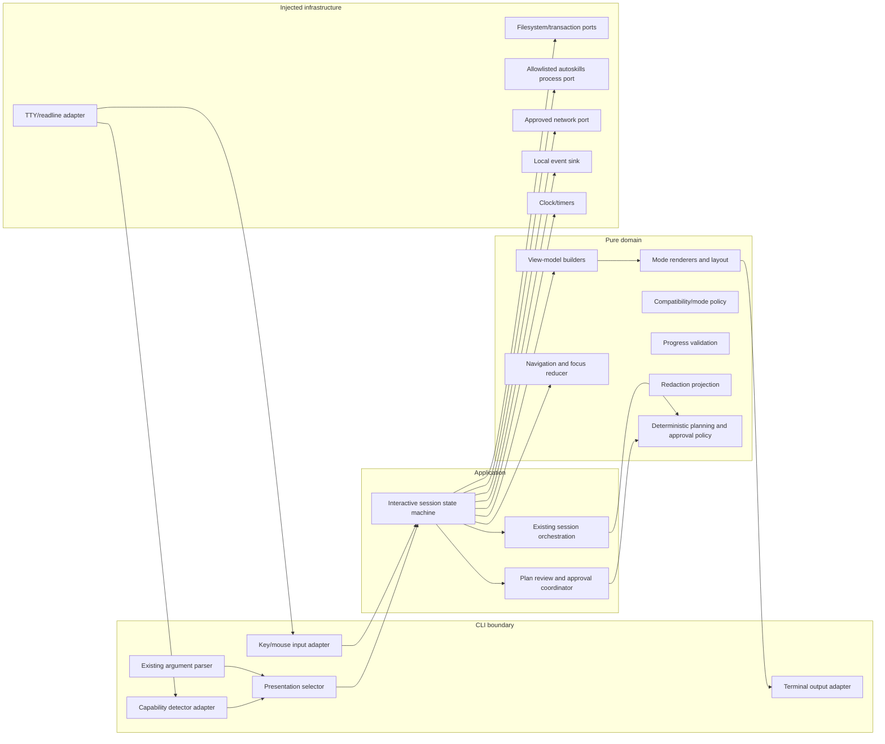

# Design Document: Modern TUI Interface

## Overview

`modern-tui-interface` adds a presentation layer for `auto-ai-setup` without changing the product’s local, consent-driven behavior. The feature is an interactive terminal experience over the existing session and planning use cases: it detects terminal capabilities, selects a compatible presentation mode, renders deterministic view models, collects keyboard-first decisions, and delegates all analysis, planning, approval, mutation, recovery, and security decisions to the existing application/domain boundaries.

The visual direction is an original `auto-ai-setup` identity. It may learn from the interaction quality of contemporary terminal tools—clear stages, compact status areas, predictable focus, inline help, and actionable recovery—but it must not copy external names, logos, wording, palettes, symbols, layouts, or other recognizable identity. The TUI never broadens the product scope: it does not execute recommended CLIs, MCP servers, arbitrary shell commands, lifecycle scripts, telemetry, remote backends, or direct Skill downloads.

The design preserves these contracts:

- `npx auto-ai-setup`, existing arguments/options, non-interactive behavior, JSON schema, semantics, and exit codes remain authoritative.
- A redirected stream or explicit non-interactive/JSON invocation never enters the interactive renderer.
- A plan is deterministic, canonicalized, SHA-256 hashed, displayed before mutation, and approved explicitly against the displayed hash.
- Filesystem changes remain local, transactional, recoverable, and containment-checked.
- Network access remains deny-by-default and is available only inside an explicitly approved official `npx autoskills` operation.
- Sensitive values are redacted before any terminal or local event sink receives them.

### Research findings informing the design

1. Node’s TTY abstraction exposes whether streams are TTYs and provides terminal dimensions that can change on resize; the adapter therefore owns capability probing and resize subscription rather than the domain. Reference: [Node.js TTY documentation](https://github.com/nodejs/node/blob/main/doc/api/tty.md).
2. `NO_COLOR` is treated as active when present with a non-empty value, so color is a presentation preference and never an information channel. Reference: [NO_COLOR specification](https://github.com/jcs/no_color/blob/master/index.md).
3. Accessibility guidance emphasizes a persistent visible focus indicator and status information that does not require moving focus; the TUI applies those principles with textual markers and persistent status rows. References: [WCAG Focus Visible](https://www.w3.org/WAI/WCAG22/Understanding/focus-visible) and [WCAG Status Messages](https://www.w3.org/WAI/WCAG22/Understanding/status-messages.html).
4. Repository inspection confirms the intended seams already exist: `src/cli` owns parsing/terminal entry points, `src/application/session` owns orchestration, planning/security are pure domain areas, and infrastructure owns filesystem/process/transaction adapters. The new design extends those seams instead of introducing a framework-dependent core.

### Scope and non-goals

In scope are capability detection, mode selection, terminal rendering, keyboard/mouse event translation, session navigation, plan review, approval prompts, progress/error/recovery presentation, accessibility, deterministic view models, performance instrumentation, and test fakes. Out of scope are new domain capabilities, a new configuration format, automatic installation of third-party tools, remote execution, telemetry, and changing existing CLI contracts.

## Architecture

The architecture is hexagonal and dependency-directed inward:



### Layer responsibilities

**CLI boundary (`src/cli/`)** parses the unchanged command contract, determines whether interactive presentation is eligible, builds adapters, and maps final application results to existing exit codes. It may call `process.stdin`, `process.stdout`, `process.env`, and Node TTY APIs only through the adapter construction boundary. It must not read files, invoke processes, or implement planning rules.

**Application (`src/application/session/`)** owns the session lifecycle and coordinates existing analysis, catalog, planning, approval, application, and recovery use cases. The interactive session is a reducer-driven state machine. It translates domain results into session events and commands but does not decide whether an operation is safe or permitted.

**Pure domain (`src/domain/`)** contains capability policy, mode compatibility, navigation reducers, progress validation, redacted view projections, canonical plan presentation data, and typed errors. These functions accept values and return values; they have no terminal, filesystem, process, network, timer, environment, or global-state access.

**Infrastructure (`src/infrastructure/`)** implements injected ports for TTY streams, input decoding, timers, filesystem transactions, the registered `autoskills` process, approved network, local events, and recovery. Existing adapters remain the only route to effects.

### Presentation selection policy

Selection occurs once before first output and can be recomputed on resize without rebuilding session state:

1. Explicit JSON or non-interactive flags, missing required automation input, or a non-TTY input/output selects the existing non-interactive pipeline.
2. Unknown capability values or non-positive/invalid dimensions select linear text with ASCII and no color.
3. Missing ANSI cursor repositioning selects linear text and prohibits all unsupported control sequences.
4. Missing color or active `NO_COLOR` disables color while retaining other supported presentation features.
5. Missing Unicode selects ASCII replacements for every border, icon, and symbol.
6. Valid dimensions below 80×24 with ANSI support select degraded mode; layout is compacted but essential content and actions remain.
7. A complete terminal is input/output TTY, ANSI cursor repositioning, color, Unicode, and valid dimensions at least 80×24. Exactly 80×24 qualifies.

The policy is deliberately conservative: an unknown capability is never treated as supported. A mode transition is accepted only if every named session field, including scroll position and unconfirmed input, can be represented. Otherwise the current mode remains active, unsupported controls are not emitted, and registered recovery controls are shown.

### Interactive render loop

The loop is event-driven and bounded:

1. Build or receive a domain/application session state.
2. Detect capabilities and choose a presentation mode.
3. Reduce one input event into a new session state and application command, if any.
4. Execute only the returned application command through injected ports; while it is pending, lock editable/navigation state.
5. Project the state into a redacted `ViewModel`.
6. Render the view model using the active mode and write only the resulting output frame/delta.
7. On resize, recompute layout and mode, preserve state, and render again.
8. On completion, cancellation, or controlled failure, render the final summary and return the existing exit code.

Commands are separate from rendering. A reducer cannot directly write output or mutate files; a renderer cannot dispatch a command. This prevents accidental mutation from key handling and makes replay tests deterministic.

### Integration with the planned TypeScript/Node/pnpm structure

New implementation areas should fit the planned layout without moving existing domain responsibilities:

```text
src/
├── cli/
│   ├── main.ts                 # existing contract and presentation selection
│   ├── terminal.ts             # existing terminal port; extend through adapters
│   └── tui/                    # input loop, mode adapter, output sink wiring
├── application/session/
│   ├── orchestrator.ts         # existing use-case coordination
│   └── interactive-session.ts  # reducer/command lifecycle
├── domain/
│   └── tui/                    # capability, compatibility, navigation, VM, layout
└── infrastructure/
    └── observability/          # terminal frame sink and local redacted events
```

The exact filenames may follow existing conventions, but dependency direction remains `cli -> application -> domain`; infrastructure implements ports and never becomes a domain dependency. All repository commands in documentation and development use `pnpm`. No new runtime dependency is required by this design; if one is later proposed, it must be pinned and justified against the zero-dependency runtime policy.

## Components and Interfaces

The following are design contracts, not implementation code. Each boundary uses discriminated unions and typed `Result` values where an operation can fail.

### Terminal capability adapter

`TerminalAdapter` exposes a snapshot of input/output TTY status, ANSI cursor support, color, Unicode, dimensions, `NO_COLOR`, optional mouse input, and optional animation preference. It also exposes key events, resize events, writes, and restoration of terminal input mode. Capability detection returns an explicit `unknown` variant rather than guessing.

Responsibilities:

- Probe before first output.
- Detect dimensions as positive integers only.
- Honor `NO_COLOR` before constructing a color palette.
- Enter/leave raw input mode only for a complete/degraded interactive session and always restore it in `finally`/abort paths.
- Convert platform-specific input sequences to normalized events (`Tab`, `ShiftTab`, `Enter`, `Space`, `Question`, `Escape`, arrows, printable text, mouse activation when available).
- Never expose raw escape sequences to domain reducers.

### Compatibility policy and render modes

`CompatibilityPolicy` maps `TerminalCapabilities` and invocation context to one of `nonInteractive`, `fullVisual`, `degraded`, or `linearText`. It returns a `RenderProfile` containing color/unicode/ANSI/animation permissions, width/height, symbols, and the rule explaining each downgrade. `linearText` emits sequential lines only; it does not clear, reposition, animate, or emit unsupported sequences.

A profile has explicit semantic tokens rather than embedded ANSI strings: `heading`, `secondary`, `selected`, `warning`, `error`, `success`, `focus`, `muted`, and `plain`. The renderer maps tokens to color and/or text markers. Every state is still distinguishable when color is unavailable.

### Session state machine

`InteractiveSession` is a pure reducer plus an effect coordinator. State includes the named fields required by the requirements:

- current stage/view;
- selected components and options;
- per-view stored focus;
- current plan and displayed hash;
- approval decision and approval hash;
- accumulated execution result;
- scroll offset;
- unconfirmed text/edit values;
- pending validation and validation messages;
- current presentation mode/profile;
- active operation/progress;
- errors, warnings, recovery controls/results;
- cancellation and finalization status.

The reducer receives a normalized `UiEvent` and returns `{ state, commands }`. It enforces one-event/one-action semantics: Enter activates the focused control once, Space toggles one multiselect option once, invalid actions return the exact prior state, and no reducer path mutates the project.

Navigation derives an ordered list of currently visible and enabled controls. Tab and Shift+Tab wrap circularly. On view entry, a stored focus is restored only if still visible/enabled; otherwise the first enabled control is chosen. Scroll is computed from control bounds with the minimum delta needed to make the entire control visible; if all content fits, it is zero.

### Pure view-model and layout pipeline

The pipeline is:

`SessionState -> redacted PresentationState -> ViewModel -> LayoutLines -> Frame`

The `ViewModel` contains semantic regions, labels, controls, focus marker, status messages, progress, plan rows, help, and final summary. It contains no ANSI codes, stream writes, clocks, or secrets. Layout performs deterministic wrapping and path truncation within the available width. Plan operations remain in canonical order. The `Frame` is a sequence of lines/cells tagged with semantic regions; the output adapter decides whether to emit a full frame, a minimal safe delta, or linear lines.

A renderer may preserve unchanged regions when generating a delta, but correctness is defined by the resulting terminal content matching the current model. If a model region changes, its entire semantic region is regenerated so progress updates cannot alter unrelated characters or positions.

### Progress and status presenter

The presenter accepts validated determined progress (`completed`, `total`) or indeterminate progress (`description`). Determined progress requires non-negative integers, monotonic completion, and `completed <= total`; percentage is floor(`completed * 100 / total`) when total is positive, and `0%` for `0/0`. Invalid updates retain the last valid representation and add a visible validation error. Every active task has a persistent textual description; animation is optional and disabled in linear/no-animation modes.

Status, warning, error, success, and focus have labels and non-color markers. Error views contain stage, operation, readable cause, and only registered recovery controls with enabled/disabled state. A mutation failure cannot reach final summary until recovery has produced a visible result.

### Deterministic plan review and approval

The existing planning domain remains the source of truth for canonical serialization and SHA-256. The TUI consumes a redacted `PlanViewModel`:

- canonical operation order;
- action, destination, source, reason, and conflict state;
- semantic redacted before/after descriptions for modifications;
- approved external command, all arguments, purpose, and network use;
- `no aplicable` for absent values;
- displayed plan hash.

Approval is a separate state with default rejection. The coordinator verifies that the current canonical plan hash equals the displayed hash immediately before any mutation or external operation. A mismatch discards approval and blocks both effects. Conflicting approval/rejection inputs are discarded and require a new unambiguous decision. A new approval after rejection is bound only to the hash in that new request.

### Non-interactive and JSON adapters

The existing non-interactive pipeline is selected before TUI construction. It receives the same parsed input and application ports, emits the existing contract, and never instantiates interactive controls. JSON is prepared completely in memory, redacted, schema-validated, and serialized before the first output byte. If redaction/preparation fails, stdout receives zero bytes and the existing error code is returned. Human TUI output goes to the terminal sink only; it cannot contaminate JSON stdout.

### Security and product-boundary guards

The UI is a projection, not a security boundary. Domain policy validates every operation before it reaches the coordinator. The design requires:

- redaction before view-model construction and before event/output sinks;
- lexical and real containment checks before process/mutation;
- rejection of traversal, absolute/device, NUL, and symlink-escape paths;
- process allowlisting limited to approved `autoskills` operations for the current plan hash;
- network deny-by-default, temporarily opened only for that approved operation;
- no direct download fallback when autoskills fails;
- no execution of recommended CLIs, MCP servers, arbitrary shell commands, lifecycle scripts, telemetry, or remote event transmission.

### Dependency injection and testability

The application receives typed ports for the six external effect classes: terminal input/output, time, filesystem, process, and network, with local event emission treated as a distinct injectable sink where the port set is modeled explicitly. Test scenarios use deterministic fake resources, including unavailable-resource behavior. The domain and renderer can run without a real terminal, network, filesystem, process, or wall clock. A virtual clock drives the one-second progress threshold and performance observations. Captured writes are checked for ANSI policy and redaction.

## Data Models

All models are immutable at domain boundaries. IDs and hashes use branded string types where already established by the repository. The following conceptual types should be represented as strict TypeScript discriminated unions.

### Terminal and presentation models

```text
TerminalCapabilities {
  inputTty: boolean | unknown;
  outputTty: boolean | unknown;
  ansiCursor: boolean | unknown;
  color: boolean | unknown;
  unicode: boolean | unknown;
  columns: positiveInteger | unknown;
  rows: positiveInteger | unknown;
  mouse: boolean | unknown;
  noColor: boolean;
}

InvocationMode = { kind: "interactive" }
                | { kind: "non-interactive" }
                | { kind: "json" };

PresentationMode = "full-visual" | "degraded" | "linear-text" | "non-interactive";

RenderProfile {
  mode: PresentationMode;
  width: positiveInteger | undefined;
  height: positiveInteger | undefined;
  ansi: boolean;
  color: boolean;
  unicode: boolean;
  animation: boolean;
  symbols: SymbolSet;
  downgradeReasons: readonly string[];
}
```

Unknown capabilities and invalid dimensions are explicit values during detection, but a selected profile never contains unsupported capabilities. `non-interactive` has no interactive controls and is not a fallback substitute for a redirected JSON contract.

### Session and navigation models

```text
Stage = "inspect" | "select" | "review" | "approve" | "apply"
      | "recover" | "summary" | "cancelled" | "failed";

Control {
  id: string;
  kind: "button" | "choice" | "multiselect" | "text-input" | "link-like";
  label: string;
  enabled: boolean;
  visible: boolean;
  action: ActionId;
  bounds: { top: integer; bottom: integer };
}

FocusState { viewId: string; controlId: string | undefined; }

SessionState {
  stage: Stage;
  selections: readonly Selection[];
  focusByView: ReadonlyMap<string, FocusState>;
  plan: ChangePlan | undefined;
  displayedPlanHash: Sha256 | undefined;
  approval: { decision: "none" | "approved" | "rejected" | "conflicted"; hash?: Sha256 };
  result: ExecutionSummary | undefined;
  scrollTop: nonNegativeInteger;
  unconfirmedInputs: ReadonlyMap<string, string>;
  validation: { pending: boolean; errors: readonly ValidationError[] };
  presentation: RenderProfile;
  activity: ActivityState | undefined;
  errors: readonly SessionError[];
  warnings: readonly string[];
  recovery: RecoveryState | undefined;
}
```

The state machine stores the last valid state for invalid events and treats state transitions as values. `ActionId` is closed over registered actions; arbitrary command strings are not accepted.

### View-model and frame models

```text
ViewModel {
  viewId: string;
  brandLabel: "auto-ai-setup";
  stageLabel: string;
  primaryAction: Control | undefined;
  controls: readonly Control[];
  focusControlId: string | undefined;
  sections: readonly ViewSection[];
  help: HelpModel | undefined;
  status: readonly StatusMessage[];
  progress: ProgressModel | undefined;
  plan: PlanViewModel | undefined;
  summary: SummaryViewModel | undefined;
}

Frame {
  width: positiveInteger;
  lines: readonly FrameLine[];
  ansiAllowed: boolean;
  changedRegions: readonly string[];
}
```

A view must expose `auto-ai-setup`, the current stage, and an applicable enabled primary action. `sections` contain text labels and values in flow order, so linear mode can render them sequentially without interpreting layout-only decorations.

### Progress, error, recovery, and summary models

```text
ProgressModel = {
  kind: "determined";
  description: string;
  completed: nonNegativeInteger;
  total: nonNegativeInteger;
  percent: integer;
} | {
  kind: "indeterminate";
  description: string;
};

RecoveryControl {
  id: string;
  label: string;
  action: "retry" | "correct" | "rollback" | "finish";
  enabled: boolean;
}

RecoveryState {
  result: "not-required" | "completed" | "partial" | "failed";
  controls: readonly RecoveryControl[];
  unresolvedPaths: readonly ProjectPath[];
}

SummaryViewModel {
  status: "success" | "cancelled" | "partial" | "failed";
  changes: readonly ChangeSummary[];
  omissions: readonly string[];
  recovery: RecoveryState;
  errors: readonly ReadableError[];
  warnings: readonly string[];
  exitCode: ExitCode;
}
```

Unresolved paths are deduplicated by canonical project-relative path and appear exactly once. All descriptions and summaries are already redacted.

### Plan presentation models

```text
PlanViewModel {
  operations: readonly PlanOperationView[]; // canonical order
  planHash: Sha256;
  approvalDefault: "reject";
}

PlanOperationView {
  operationId: string;
  action: string;
  destination: string; // redacted, or "no aplicable"
  source: string;      // redacted, or "no aplicable"
  reason: string;      // redacted, or "no aplicable"
  conflict: string;
  semanticChange: SemanticChangeView | undefined;
  external: ExternalOperationView | undefined;
}

ExternalOperationView {
  command: string;
  args: readonly string[];
  purpose: string;
  networkUse: string;
}
```

The model cannot contain an unredacted secret or an operation excluded by product policy. The coordinator compares `planHash` with a freshly calculated hash at the effect boundary, not merely with the value held by the view.

### Test and effect models

```text
UiEvent = KeyEvent | MouseEvent | ResizeEvent | ActivityEvent
         | ExternalResultEvent | TimerEvent;

UiCommand = "none" | { kind: "run-stage"; stage: Stage }
          | { kind: "apply-approved-plan"; hash: Sha256 }
          | { kind: "recover"; controlId: string }
          | { kind: "exit"; reason: ExitReason };

EffectPorts {
  terminal: TerminalPort;
  clock: ClockPort;
  filesystem: FilesystemPort;
  process: AllowlistedProcessPort;
  network: ApprovedNetworkPort;
  events: LocalEventSink;
}
```

Fakes implement the same ports and can be marked unavailable. No test may silently fall through to a real effect. Captured terminal output, view models, state transitions, plan hashes, and typed errors are the primary observables.

## Correctness Properties

A property is a characteristic or behavior that should hold true across all valid executions of a system—essentially, a formal statement about what the system should do. Properties bridge human-readable requirements and executable correctness guarantees. The properties below target the pure domain/reducer/projection layers; infrastructure and external-contract checks are specified separately in the Testing Strategy.

### Property 1: Capability policy is conservative and complete

For any terminal capability snapshot, the selected presentation profile SHALL use full visual mode exactly when all complete-terminal requirements are known and satisfied, use degraded mode only for valid undersized ANSI-capable terminals, and otherwise use linear text or non-interactive mode; unsupported color, Unicode, animation, and control sequences SHALL never be enabled.

**Validates: Requirements 1.2, 1.3, 1.4, 1.5, 1.6, 1.7, 1.11, 9.3**

### Property 2: Presentation transitions preserve session state

For any valid session state and any compatible resize or presentation transition that can represent its fields, the resulting state SHALL preserve every named session field, including selections, approvals, result, scroll offset, unconfirmed inputs, and validation state, while selecting only resources supported by the new profile.

**Validates: Requirements 1.9, 8.8, 9.4**

### Property 3: Navigation is circular and focus remains valid

For any view containing enabled controls and any valid focused control, forward and backward navigation SHALL select the circular successor or predecessor in the documented order, and after every valid navigation step exactly one visible enabled control SHALL have focus.

**Validates: Requirements 2.1, 2.2, 2.3, 2.4, 2.7, 2.8, 9.5**

### Property 4: Focused activation and toggling are exactly once

For any session state with an enabled focused control, one Enter event SHALL produce at most one activation of that control, and for any focused multiselect option, one Space event SHALL change only that option’s selection exactly once.

**Validates: Requirements 2.5, 2.6**

### Property 5: Invalid actions are immutable

For any session state and action that is not valid for the current view, reducing the action SHALL return an equivalent session state and SHALL emit no mutation, external-operation, or application command.

**Validates: Requirements 2.9, 9.6**

### Property 6: Validation preserves input and gates advancement

For any editable value and active validation rules, the validation projection SHALL preserve the user’s editable value, enumerate every violated rule without duplication, and disable every advance action whenever validation is invalid or pending while leaving non-advance actions governed by their original availability.

**Validates: Requirements 2.12, 2.13, 4.8, 4.10**

### Property 7: Viewport scrolling is minimal and bounded

For any ordered layout, focused control bounds, and available viewport, the computed scroll offset SHALL show the entire focused control using the minimum required movement, and SHALL be zero whenever all content fits in the viewport.

**Validates: Requirements 2.10, 2.11**

### Property 8: Layout is deterministic and preserves semantic order

For any view content and positive terminal width, wrapping and path truncation SHALL produce the same bounded output on repeated evaluation, preserve semantic content order, and include a truncation indicator whenever a path cannot fit in full.

**Validates: Requirements 3.4, 3.5, 9.1**

### Property 9: Fallback projection preserves essential meaning

For any complete-mode view model and any degraded or linear profile, the projected view SHALL preserve all essential labels, values, hierarchy, applicable enabled primary actions, and their order while replacing or removing only unsupported adornments and resources.

**Validates: Requirements 3.2, 3.8, 3.10, 4.6, 9.3**

### Property 10: Semantic states remain distinguishable without color

For any pair of distinct semantic states and any profile with color disabled, the rendered state SHALL remain distinguishable through textual labels, markers, or structure; focus, selection, warning, error, success, and primary state markers SHALL not be reused ambiguously.

**Validates: Requirements 3.1, 4.1, 4.2, 4.3**

### Property 11: Activity and help are accessible and non-disruptive

For any active activity, editable control, or session state, the view SHALL keep the activity description or associated input label visible; pressing `?` SHALL toggle contextual help without changing focus or selections, and a no-animation profile SHALL produce identical output across timer ticks when the described activity is unchanged.

**Validates: Requirements 4.4, 4.5, 4.7, 4.9**

### Property 12: Determined progress is valid, monotonic, and correctly calculated

For any valid determined progress update with non-negative integer counts, completion SHALL never decrease or exceed total, and when total is positive the displayed percentage SHALL equal the floor of `completed × 100 / total`; the zero-by-zero case SHALL display `0%`.

**Validates: Requirements 5.2, 5.3, 5.4**

### Property 13: Invalid progress does not corrupt the last valid state

For any valid progress representation followed by an invalid determined update, the displayed representation SHALL remain byte-equivalent to the last valid representation and SHALL expose the violated validation rule; for any indeterminate update, the display SHALL contain its description and no percentage or unit counts.

**Validates: Requirements 5.5, 5.6**

### Property 14: Redaction is complete before presentation

For any generated view input containing known sensitive literals in values, keys, paths, errors, progress, plan changes, or results, neither the redacted view model nor any captured terminal/local-event output SHALL contain any sensitive literal.

**Validates: Requirements 5.7, 6.7, 9.7**

### Property 15: Failure projection is registered and actionable

For any session state and typed operation failure, all named session fields SHALL remain unchanged, the view SHALL identify the stage, operation, and readable cause, and the recovery controls SHALL equal exactly the registered controls with explicit enabled/disabled state.

**Validates: Requirements 5.8, 5.9**

### Property 16: Recovery summary is complete and exact-once

For any accumulated execution result, the final summary SHALL contain status, changes, omissions, recovery result, exit code, errors, and warnings; every unresolved canonical path SHALL occur exactly once.

**Validates: Requirements 5.11, 5.12**

### Property 17: Canonical plans and projections are stable

For any pair of equivalent inputs and equivalent project states, canonical plan bytes SHALL be identical; every projected plan SHALL retain canonical operation order, expose the plan hash and required operation fields, use `no aplicable` for absent values, include a semantic redacted before/after description for existing-content modifications, and include all allowed external-operation arguments and metadata.

**Validates: Requirements 6.1, 6.3, 6.4, 6.5, 6.6**

### Property 18: Approval is bound to the current plan hash

For any plan approval state, a missing, rejected, conflicting, or hash-mismatched decision SHALL block mutations and external operations; only an unambiguous approval for the current displayed hash SHALL produce an apply command, and a new approval after rejection SHALL bind only to the newly displayed hash.

**Validates: Requirements 6.9, 6.12, 6.13, 6.17**

### Property 19: Deterministic rendering has no stale regions

For any prior and current view models, the completed rendered frame SHALL contain only characters represented by the current model; when only a progress region changes, every unchanged region SHALL retain identical characters and positions.

**Validates: Requirements 3.6, 8.6**

### Property 20: Pending work locks unsafe session edits

For any session with an application task in progress and any generated navigation or edit event, the reducer SHALL prevent changes to task inputs and results while still allowing only explicitly permitted status/help/cancellation actions.

**Validates: Requirements 8.7**

### Property 21: Reducers and view models are replay-deterministic

For any initial state, injected capabilities/dimensions, and generated key sequence of length 1 to 100, replaying the sequence twice SHALL produce identical state and command sequences; equivalent inputs SHALL produce identical view-model content, order, and focus.

**Validates: Requirements 9.1, 9.2**

### Property 22: Managed configuration updates preserve user data

For any JSON configuration containing unknown fields, duplicate entries, and unrelated array ordering, applying a valid managed update SHALL preserve those fields, unrelated order, and multiplicity while changing only owned values.

**Validates: Requirements 10.6**

### Property 23: Hostile lexical paths are rejected before effects

For any path containing traversal, an absolute/device form, a NUL character, or another prohibited lexical form, path policy SHALL return a typed rejection and the application SHALL emit no process or mutation command.

**Validates: Requirements 10.8, 10.10**

## Error Handling

Errors are modeled as typed, discriminated results at domain and application boundaries. Unexpected exceptions are normalized at the CLI boundary into the existing controlled error contract; raw exception text is never rendered directly without redaction and context.

### Capability and rendering errors

- Unknown capabilities and invalid dimensions use the conservative linear ASCII profile.
- An impossible resize/profile transition does not silently discard state. The session remains in the current mode, identifies the non-preservable element, and exposes only registered recovery actions.
- A stream write failure ends the interactive loop through the existing controlled error path after attempting terminal restoration. It must not retry indefinitely or initiate a mutation.
- Terminal cleanup is idempotent: raw mode, cursor visibility, mouse reporting, and pending timers are restored on normal completion, cancellation, controlled error, and process interruption.

### Input, validation, and navigation errors

- Unknown key sequences are ignored or shown as contextual help; they never dispatch arbitrary commands.
- Invalid actions preserve state and emit no effects.
- Invalid or restored values remain editable, enumerate all failed rules, and disable only advance actions.
- When no enabled controls exist, focus is explicitly absent and the view must provide a valid non-advancing action such as help, correction, cancellation, or finish according to stage policy.

### Progress and activity errors

- Progress updates are accepted only when their discriminated shape and numeric invariants are valid.
- Invalid progress retains the last valid model and reports the rejected rule.
- Indeterminate work never displays fabricated counts or percentages.
- A task exceeding one second receives a persistent textual activity status even when animation is disabled.
- Progress/status values pass through redaction before rendering.

### Plan, approval, and security errors

- A stale plan hash immediately invalidates approval and blocks both mutation and external operation commands.
- Conflicting decisions are discarded rather than resolved by precedence.
- Prohibited operations are rejected before plan insertion and before process/network/filesystem calls.
- Unsafe paths, symlink escapes, and failed containment checks are typed security errors and cannot be downgraded to warnings.
- Redaction failure is fail-closed: JSON produces zero stdout bytes; human output produces no unredacted fallback.
- Recommended CLIs, MCP servers, arbitrary shell commands, lifecycle scripts, telemetry, and alternate Skill downloads have no recovery path that executes them. The user receives a boundary explanation and registered safe actions only.

### Mutation and recovery errors

The transaction adapter owns copy/staging, persistent journal, verification, atomic application, rollback, and recovery. The TUI observes typed lifecycle events. A mutation failure must first render recovery controls and a visible recovery result; only then may it render the final summary. Partial recovery lists each unresolved path once, preserves the existing exit code semantics, and never claims success for an unverified result.

### Non-interactive and JSON errors

Non-interactive execution never waits for missing input. JSON preparation is atomic with respect to stdout: build, redact, validate, and serialize in memory before writing. Any preparation/redaction failure writes zero bytes to stdout and returns the existing contract error code. Human diagnostics may use stderr only where permitted by the existing contract and must also be redacted.

## Testing Strategy

Property-based testing applies because the feature has substantial pure input/output logic: capability policy, navigation, focus, validation, layout, progress arithmetic, redaction, plan projection, approval gating, state transitions, and configuration merging. It does not replace integration tests for terminal streams, transaction durability, process/network policy, CLI compatibility, or external boundaries.

### Property tests

Use the pinned repository versions of Vitest and `fast-check`; do not implement a generator or property runner from scratch. Every property test runs at least 100 cases and uses deterministic seed/configuration from the existing test setup. Each test contains a comment in this form:

```text
Feature: modern-tui-interface, Property N: <property text>
```

Implement one property-based test per numbered property, with generators for:

- capability matrix values, including unknowns, invalid dimensions, `NO_COLOR`, and 80×24 boundaries;
- session states, view control sets, focus positions, actions, validation rules, and key sequences;
- widths/heights, text, Unicode/ASCII symbol sets, paths, and plan operations;
- determined/indeterminate progress sequences and virtual-clock timestamps;
- nested values containing known secrets;
- equivalent JSON configurations with unknown fields, duplicates, and reordered unrelated arrays;
- hostile lexical paths.

Prefer model-based or oracle-based assertions: a small reference navigation model, canonical semantic ordering, exact integer arithmetic, and deep state equality. Do not use wall-clock sleeps, real TTYs, public network calls, real process execution, or real project mutation in property tests.

### Unit and example tests

Use focused unit/example tests for finite or contractual behavior:

- exact 80×24 full-mode selection;
- `0/0` progress as `0%`;
- exact `ÉXITO`, `ADVERTENCIA`, and `ERROR` labels and distinct markers;
- approval defaulting to rejection;
- known SHA-256 canonical-plan vectors;
- `?` help toggle examples and mouse alternative behavior;
- exact existing exit-code fixtures;
- status threshold observations at one millisecond before, at, and after 100/250/300/1000ms limits;
- visual identity snapshots reviewed for original wording/symbols and absence of external product branding.

Snapshots should target semantic view models and linear output rather than terminal escape-heavy full frames. If a full-frame snapshot is needed, keep ANSI enabled/disabled fixtures separate and assert the semantic model first.

### Integration tests with injected fakes

Use terminal, clock, filesystem, process, network, and event-sink fakes to verify:

- redirected streams and non-interactive/JSON bypass TUI controls and preserve the current contract;
- every compatibility-matrix family reaches completion, cancellation, or controlled error and restores terminal state;
- keyboard-only end-to-end journeys cover inspect, selection, review, approval, apply, recovery, and summary;
- resize and progress event ordering remains safe during asynchronous application work;
- mutation failure renders recovery before summary and transaction traces include journal/verify/rollback behavior;
- matching plan approval applies exactly canonical operations; mismatched approval applies none;
- approved `autoskills` network use is scoped to the approved operation and hash;
- unavailable fake resources fail without falling through to real adapters;
- recommended CLIs/MCP servers remain descriptive only;
- autoskills failure does not initiate direct downloads or alternate installation flows;
- JSON redaction completes before the first byte, and redaction failure emits zero stdout bytes;
- lexical and real containment checks reject unsafe paths before process/mutation calls.

### Smoke and performance tests

Smoke checks verify the repository-level constraints: `pnpm` is the only documented workflow command, TypeScript strict compilation and packaging remain valid, six effects can be wired with fakes, and the built CLI starts with the existing portable entry point. These checks use the actual package scripts as their source of truth and never invoke public services.

Performance checks run on the defined `Perfil_de_Rendimiento_TUI` using fixed local fixtures and a virtual clock where possible:

- first visible view after initial validation: at most 300ms;
- navigation focus/selection: at most 100ms;
- resize adaptation: at most 250ms;
- textual activity update at least once per second;
- 1,000-operation plan navigation: at most 100ms.

Rendering should use bounded layout work and windowed plan rows rather than rebuilding unrelated regions. Performance failures are reported separately from functional failures because host load can affect wall-clock measurements, but the thresholds remain release criteria on the specified profile.

### Traceability and acceptance review

Each property, example, integration test, and smoke test must reference its requirements clauses. The existing traceability tooling and pnpm CI workflow remain authoritative. Before implementation is considered complete, review every requirement against the design and confirm that no TUI path can bypass approval, redaction, containment, transaction recovery, non-interactive preservation, or the product’s prohibited-operation boundaries.
