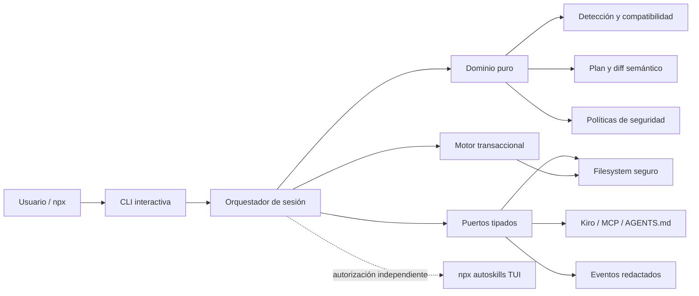
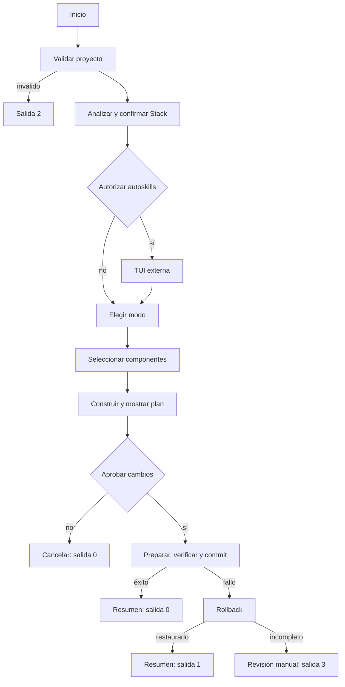

# auto-ai-setup

CLI local e interactiva para preparar proyectos nuevos o existentes para flujos de trabajo con agentes de IA. Detecta evidencia tecnológica, recomienda componentes compatibles y permite configurar integraciones de Kiro, servidores MCP, reglas `AGENTS.md` y comandos reutilizables mediante un plan determinista que requiere aprobación explícita.

> Estado: MVP `0.1.0`. La demostración y el video público del hackathon están pendientes de publicación.

## Requisitos previos

- Node.js 20 o superior.
- `npx`, incluido con npm.
- Una terminal interactiva (TTY de entrada y salida).
- Permisos de lectura y escritura sobre el proyecto objetivo.
- Conexión de red únicamente si se autoriza abrir la TUI oficial `npx autoskills`.

`auto-ai-setup` no requiere instalación global.

## Inicio rápido

```powershell
npx auto-ai-setup@0.1.0
```

La CLI solicita el proyecto si no se indica `--path`, analiza su Stack, permite confirmarlo, solicita el modo, presenta componentes y muestra el Plan de Cambios antes de escribir archivos.

Opciones disponibles:

| Opción                | Descripción                                                                        |
| --------------------- | ---------------------------------------------------------------------------------- |
| `--path <ruta>`       | Proyecto objetivo; si se omite, se solicita de forma interactiva.                  |
| `--mode auto\|manual` | Fija el modo de selección; si se omite, la CLI lo solicita.                        |
| `--verbose`           | Incluye evidencias de Stack y decisiones de compatibilidad en los eventos locales. |
| `--recover`           | Busca y recupera una transacción incompleta del proyecto indicado.                 |

La CLI no dispone de modo headless en el MVP: incluso con flags necesita una TTY para confirmaciones y selección.

## Ejemplos reproducibles

### Modo automático

```powershell
npx auto-ai-setup@0.1.0 --path . --mode auto
```

El modo automático parte de los componentes compatibles recomendados para el Stack confirmado. El usuario puede retirar recomendaciones antes de revisar y aprobar el plan.

### Modo manual

```powershell
npx auto-ai-setup@0.1.0 --path . --mode manual --verbose
```

El modo manual muestra el inventario de componentes agrupado por tipo y deja la selección en manos del usuario. Los componentes incompatibles requieren una confirmación específica y quedan identificados en el plan.

### Recuperación

```powershell
npx auto-ai-setup@0.1.0 --path . --recover
```

`--recover` restaura una transacción local incompleta encontrada en `.auto-ai-setup/transactions`. Si no existe una transacción recuperable, la ejecución termina como entrada inválida con código `2`.

## Flujo de uso

1. Seleccionar y validar el directorio objetivo.
2. Detectar evidencia local y presentar el Stack.
3. Resolver conflictos y confirmar el Stack.
4. Autorizar o rechazar por separado la TUI oficial de Skills.
5. Elegir modo automático o manual y seleccionar componentes locales.
6. Revisar el Plan de Cambios, su diff semántico y su hash SHA-256.
7. Aprobar globalmente y resolver conflictos individuales.
8. Aplicar la transacción o cancelar sin cambios.
9. Consultar el resumen con elementos aplicados, omitidos, advertencias y errores.

## Capacidades del MVP

- Detecta tecnologías a partir de evidencia local sin enviar el proyecto a servicios remotos.
- Recomienda CLIs relacionadas con el Stack, pero no comprueba, instala ni ejecuta `gh`, `supabase`, `vercel`, `playwright` u otras herramientas recomendadas.
- Configura servidores MCP de workspace en `.kiro/settings/mcp.json` sin ejecutar los servidores.
- Gestiona reglas portables en `AGENTS.md` y prompts en `.kiro/prompts/` con un índice JSON local.
- Preserva campos de configuración desconocidos y contenido ajeno a los cambios aprobados.
- Puede abrir, con autorización dedicada, la TUI oficial de `autoskills` para que esta gestione Skills de forma independiente.

## Arquitectura

El proyecto usa arquitectura hexagonal por capas. La dirección de dependencias es `cli -> application -> domain`; la infraestructura implementa puertos tipados definidos hacia el interior.

| Componente                         | Responsabilidad                                                            |
| ---------------------------------- | -------------------------------------------------------------------------- |
| `src/cli`                          | Flags, TTY, interacción, render y códigos de proceso.                      |
| `src/application/session`          | Máquina de estados y coordinación de casos de uso.                         |
| `src/domain`                       | Detección, compatibilidad, configuración, planificación y seguridad puras. |
| `src/infrastructure/fs`            | Escaneo seguro, staging, backups y escrituras atómicas.                    |
| `src/infrastructure/agent`         | Adaptadores para Kiro, MCP, `AGENTS.md` y comandos.                        |
| `src/infrastructure/process`       | Única invocación interactiva permitida: `npx autoskills`.                  |
| `src/infrastructure/transaction`   | Journal, commit, rollback y recuperación.                                  |
| `src/infrastructure/observability` | Eventos locales y render humano con redacción.                             |



La línea discontinua representa un límite deliberado: `autoskills` no forma parte de la transacción local de `auto-ai-setup`.

### Flujo principal



## Decisiones técnicas principales

- TypeScript estricto, Node.js 20+, ESM, salida en `dist/` y shebang portable mediante `package.json#bin`.
- Dominio determinista sin APIs de terminal, filesystem, procesos, red ni entorno.
- Puertos y adaptadores con inyección de dependencias para aislar efectos.
- JSON como único formato estructurado escrito por el MVP.
- Planes estables, serialización canónica, diffs semánticos y hashes SHA-256.
- Operaciones idempotentes: repetir la misma selección sobre un estado equivalente no crea cambios duplicados.
- Configuración conservadora: se preservan campos desconocidos, valores no gestionados y contenido propiedad del usuario.
- Red denegada por defecto y ejecución de procesos limitada a adaptadores registrados.
- `pnpm` es el gestor de paquetes de desarrollo; el usuario final ejecuta la CLI con `npx`.

El SDD completo está disponible en [`.kiro/specs/auto-ai-setup/`](.kiro/specs/auto-ai-setup/), con [requisitos](.kiro/specs/auto-ai-setup/requirements.md), [diseño](.kiro/specs/auto-ai-setup/design.md), [tareas](.kiro/specs/auto-ai-setup/tasks.md) y [trazabilidad](.kiro/specs/auto-ai-setup/traceability.md).

## Seguridad

### Fuente confiable para Skills

El MVP no mantiene un catálogo propio. La única fuente autorizada para consultar y gestionar Skills es la TUI oficial [`midudev/autoskills`](https://github.com/midudev/autoskills), invocada como `npx autoskills` después de mostrar comando, propósito, uso de red y límite transaccional. Rechazar la autorización evita iniciar el proceso y abrir esa conexión.

La selección, descarga e instalación de Skills ocurren dentro de la TUI externa. Sus cambios y su salida directa quedan fuera del Plan de Cambios, journal, redacción, rollback, recuperación e idempotencia garantizados por `auto-ai-setup`. La CLI nunca descarga archivos de Skills directamente ni ejecuta scripts de ciclo de vida en su nombre.

### Protección local

- **Aprobación:** ningún archivo gestionado cambia antes de mostrar y aprobar el plan. Los reemplazos en conflicto requieren aprobación específica.
- **Red:** se deniega por defecto. El MVP no ejecuta operaciones de red arbitrarias; `autoskills` requiere autorización previa e independiente.
- **Secretos:** previews, planes y eventos locales producidos por `auto-ai-setup` reemplazan tokens, contraseñas, credenciales, claves privadas y valores equivalentes por `[REDACTED]`.
- **Rutas:** se rechazan rutas absolutas de destino, traversal, NUL, dispositivos y escapes mediante enlaces simbólicos; todo cambio local debe permanecer dentro de la raíz canónica del proyecto.
- **Procesos:** no se aceptan comandos de shell libres ni se ejecutan CLIs recomendadas, servidores MCP o scripts de paquetes.
- **Datos:** el análisis, los registros y el plan permanecen locales. No hay telemetría, login ni sincronización cloud.

No incluyas secretos literales en componentes o prompts. Usa referencias a variables de entorno como `${NOMBRE_VARIABLE}`.

## Recuperación y códigos de salida

Los cambios locales aprobados se preparan en staging, se verifican y se aplican con escrituras atómicas. La CLI conserva backups y un journal persistente bajo `.auto-ai-setup/transactions` hasta completar el commit o el rollback. Al iniciar una ejecución, un journal incompleto activa la recuperación antes de permitir cambios nuevos.

| Código | Significado                                                                  | Acción recomendada                                                    |
| ------ | ---------------------------------------------------------------------------- | --------------------------------------------------------------------- |
| `0`    | Éxito, ejecución sin cambios o cancelación segura.                           | Ninguna.                                                              |
| `1`    | Falló una operación, pero el estado local anterior fue restaurado.           | Revisar el error informado y volver a intentar si corresponde.        |
| `2`    | Entrada, ruta, modo, configuración o plan inválido antes de aplicar cambios. | Corregir los datos indicados.                                         |
| `3`    | Ejecución o recuperación incompleta.                                         | Revisar obligatoriamente las rutas enumeradas en `manualReviewPaths`. |

Si una ejecución termina con código `3`, no asumas que el proyecto volvió a su estado anterior. Conserva `.auto-ai-setup/transactions`, revisa las rutas informadas y ejecuta nuevamente con `--recover` después de resolver la causa subyacente.

Estas garantías cubren únicamente archivos y operaciones propiedad de `auto-ai-setup`; no cubren los efectos de la TUI externa de Skills.

## Desarrollo

Clona el repositorio e instala las dependencias bloqueadas:

```powershell
git clone https://github.com/HeberYesid/auto-ai-setup.git
Set-Location auto-ai-setup
corepack enable
pnpm install --frozen-lockfile
```

Comandos reproducibles definidos en `package.json`:

| Objetivo                       | Comando                     |
| ------------------------------ | --------------------------- |
| Formatear                      | `pnpm run format`           |
| Comprobar formato              | `pnpm run format:check`     |
| Análisis estático              | `pnpm run lint`             |
| Comprobar tipos                | `pnpm run typecheck`        |
| Pruebas unitarias              | `pnpm run test:unit`        |
| Pruebas de integración         | `pnpm run test:integration` |
| Pruebas basadas en propiedades | `pnpm run test:property`    |
| Todas las pruebas              | `pnpm run test`             |
| Cobertura                      | `pnpm run test:coverage`    |
| Compilar                       | `pnpm run build`            |
| Empaquetar                     | `pnpm run pack`             |
| Smoke test                     | `pnpm run smoke`            |
| Validar trazabilidad SDD       | `pnpm run traceability`     |
| Pipeline completo              | `pnpm run ci`               |

El pipeline de CI ejecuta formato, lint, tipos, pruebas deterministas, umbrales de cobertura del 80 %, compilación, empaquetado, smoke test y trazabilidad. Las pruebas no dependen de la red pública.

### Benchmark reproducible

El benchmark de análisis local está separado de las comprobaciones normales de PR:

```powershell
pnpm run build
node benchmarks/run-benchmark.mjs --fixture .benchmark/fixture --generate --files 10000 --bytes 500000000 --cache warm --output .benchmark/report.json
```

Registra diez ejecuciones, perfil del equipo, estado declarado de caché, tiempo desde escaneo hasta presentación del Stack y RSS máxima. Consulta [`benchmarks/README.md`](benchmarks/README.md) para el procedimiento completo.

## Límites del MVP y trabajo futuro

El MVP se limita a una CLI local e interactiva. No implementa ni invoca:

- inferencia mediante AWS Bedrock;
- backend serverless en AWS;
- hooks de seguridad automáticos;
- telemetría, autenticación o sincronización cloud;
- ejecución de servidores MCP;
- instalación automática de CLIs recomendadas;
- comandos arbitrarios o administración global del equipo.

AWS Bedrock, un backend serverless y los hooks de seguridad son **trabajo futuro**, no dependencias ocultas del flujo principal. Actualmente no existe una demo AWS. Si se publica una, será un experimento independiente que no intervendrá en archivos, procesos ni resultados de esta CLI.

Otras líneas futuras incluyen un modo headless auditable, adaptadores para más agentes, políticas organizacionales firmadas y una experiencia de recuperación asistida. Cada extensión deberá conservar consentimiento explícito, red denegada por defecto y límites transaccionales visibles.

## Impacto e innovación

Configurar un proyecto para agentes suele exigir descubrir herramientas, editar varios formatos y aceptar instalaciones con límites poco claros. `auto-ai-setup` convierte esa preparación en un flujo local, explicable y recuperable: evidencia del proyecto -> Stack confirmado -> selección -> plan verificable -> aprobación -> resumen.

Sus elementos diferenciales son:

- **Consentimiento como dato:** cada aprobación queda ligada al hash del plan, no a una confirmación ambigua.
- **Seguridad transaccional:** staging, backups, journal, verificación, rollback y recuperación forman parte del flujo normal.
- **Preservación semántica:** los adaptadores modifican únicamente campos gestionados y conservan configuración del usuario.
- **Recomendaciones sin efectos ocultos:** detectar una oportunidad no implica instalar ni ejecutar una herramienta.
- **Límites explícitos:** la TUI externa de Skills se muestra como un sistema independiente, sin atribuirle garantías locales que la CLI no controla.
- **Arquitectura extensible:** nuevos agentes se incorporan mediante adaptadores sin contaminar el dominio puro.

Esto reduce tiempo de preparación, errores manuales y riesgo de sobrescritura, a la vez que deja evidencia auditable de qué se propuso, qué se aprobó y qué ocurrió.

## Uso de Kiro

Kiro se utilizó como entorno de desarrollo y soporte del proceso SDD:

- **Specs:** formalización incremental de requisitos, diseño, tareas y trazabilidad bidireccional en `.kiro/specs/`.
- **Steering:** reglas persistentes de producto, estructura y tecnología en `.kiro/steering/`.
- **Desarrollo asistido:** implementación por capas, revisión de límites arquitectónicos y validación contra criterios de aceptación.
- **Pruebas y calidad:** generación y ejecución de casos unitarios, de integración, propiedades, smoke y validación de trazabilidad.
- **Integración objetivo:** configuración segura de MCP y prompts reutilizables para workspaces de Kiro, sin iniciar servidores MCP.

## Demostración y video

Los enlaces definitivos están pendientes de publicación:

- **Demostración funcional:** pendiente. Mostrará selección del proyecto, detección y confirmación del Stack, modo automático/manual, Plan de Cambios, aprobación y Resumen de Ejecución.
- **Video público (máximo 5 minutos):** pendiente. Cubrirá problema, solución, impacto, uso de Kiro y una ejecución funcional completa.

Hasta añadir URLs públicas, los criterios 14.12, 14.13 y 14.14 del SDD permanecen abiertos; no se incluyen enlaces ficticios.

## Licencia

Distribuido bajo la [licencia MIT](LICENSE). Copyright © 2026 Heber Yesid.
