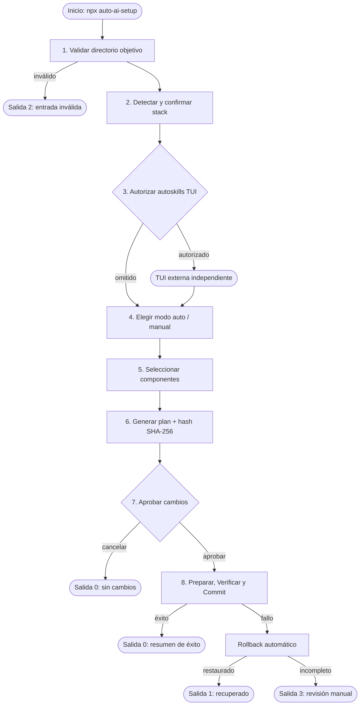
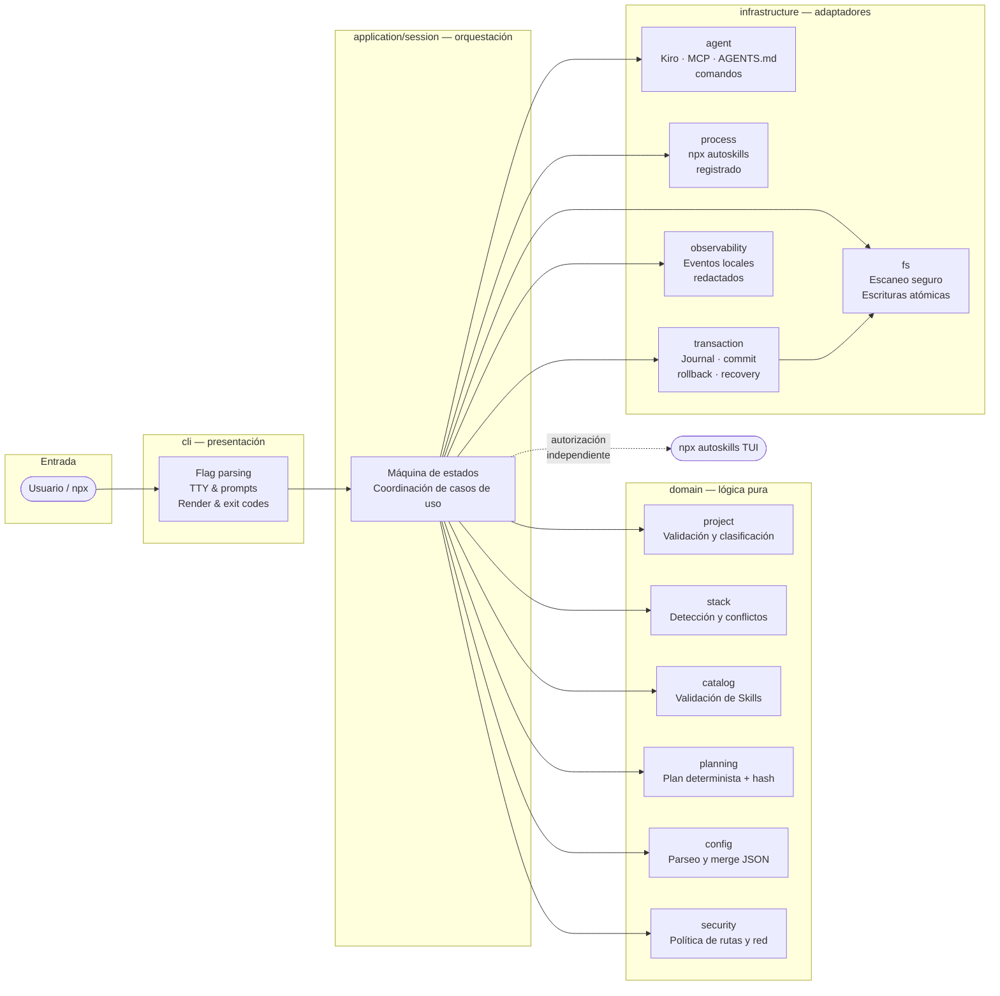
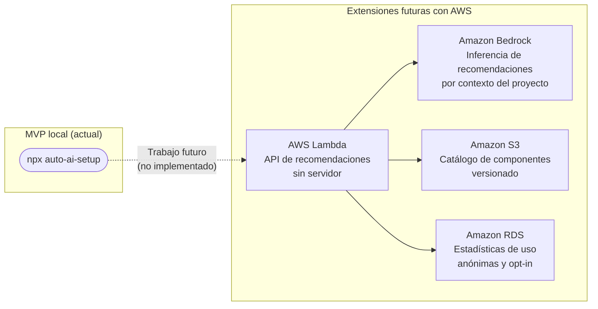

# auto-ai-setup

> **CLI local e interactiva para preparar proyectos para flujos de trabajo con agentes de IA.**

Analiza evidencia local, detecta el stack tecnológico, recomienda CLIs relacionadas y permite configurar servidores MCP, reglas `AGENTS.md`, comandos reutilizables y Skills mediante un plan determinista que requiere aprobación explícita antes de escribir cualquier archivo.

[](https://github.com/HeberYesid/auto-ai-setup/actions)
[](https://www.npmjs.com/package/auto-ai-setup)
[](LICENSE)

---

## 🎯 Demo y video

| Recurso                            | Enlace                                                |
| ---------------------------------- | ----------------------------------------------------- |
| **Demo funcional**                 | 🔗 _(enlace pendiente — se publicará en AWS Amplify)_ |
| **Video de presentación (≤5 min)** | 🎥 _(enlace pendiente — YouTube)_                     |
| **Asciinema interactivo**          | 💻 _(enlace pendiente — asciinema.org)_               |

> Los enlaces se actualizarán al publicar los entregables finales del hackathon. La demo se desplegará en AWS Amplify; el asciinema mostrará la ejecución completa del flujo principal.

---

## ¿Qué problema resuelve?

Configurar un proyecto nuevo para trabajar con agentes de IA (Kiro, Claude, Copilot) es un proceso manual y propenso a errores:

- Editar manualmente `.kiro/settings/mcp.json`, `AGENTS.md` y `.kiro/prompts/` en cada proyecto
- Buscar qué Skills existen y cuáles aplican al stack del proyecto
- Riesgo de sobrescribir configuraciones existentes sin backup ni rollback
- Sin plan visible ni aprobación explícita antes de aplicar cambios

**`auto-ai-setup` convierte esa preparación en un flujo local, explicable y recuperable:**

```
evidencia del proyecto → stack confirmado → selección → plan verificable → aprobación → resumen
```

---

## Inicio rápido

```bash
npx auto-ai-setup@0.1.0
```

No requiere instalación global. La CLI solicita el proyecto si no se indica `--path`, detecta el stack, presenta un plan y aplica los cambios únicamente tras aprobación explícita.

### Opciones disponibles

| Opción                | Descripción                                                                     |
| --------------------- | ------------------------------------------------------------------------------- |
| `--path <ruta>`       | Proyecto objetivo; si se omite, se solicita interactivamente.                   |
| `--mode auto\|manual` | Fija el modo de selección; si se omite, la CLI lo solicita.                     |
| `--verbose`           | Incluye evidencias de stack y decisiones de compatibilidad en los eventos.      |
| `--recover`           | Busca y recupera una transacción incompleta del proyecto indicado.              |
| `--non-interactive`   | No solicita nada; requiere `--path` y `--mode`. Previsualiza y no aplica nada.  |
| `--json`              | Como `--non-interactive` y escribe un único resumen JSON redactado en `stdout`. |
| `-h`, `--help`        | Muestra la ayuda de uso.                                                        |
| `-V`, `--version`     | Muestra la versión.                                                             |

Una ejecución automatizada nunca puede aprobar una mutación: la aprobación explícita exige una
persona en una terminal, así que `--non-interactive` y `--json` calculan y reportan el plan sin
modificar el proyecto. Ambas requieren `--mode auto`, porque el modo manual necesita una selección
interactiva. La ayuda, la versión y los errores de invocación se escriben en `stderr`, de modo que
`stdout` conserva únicamente el valor JSON en el modo procesable.

---

## Ejemplos reproducibles

### Modo automático — proyecto existente

```bash
npx auto-ai-setup@0.1.0 --path . --mode auto
```

Recomienda componentes compatibles con el stack detectado. El usuario puede retirar recomendaciones antes de revisar y aprobar el plan.

### Modo manual — con verbosidad

```bash
npx auto-ai-setup@0.1.0 --path . --mode manual --verbose
```

Muestra el inventario completo agrupado por tipo (MCP, reglas, comandos, Skills). Los incompatibles requieren confirmación específica y quedan marcados en el plan.

### Recuperación de transacción incompleta

```bash
npx auto-ai-setup@0.1.0 --path . --recover
```

Restaura el estado anterior a partir del journal en `.auto-ai-setup/transactions`.

---

## Flujo de uso



---

## Arquitectura

El proyecto sigue arquitectura hexagonal por capas. La dirección de dependencias es `cli → application → domain`; la infraestructura implementa puertos tipados definidos hacia el interior.



### Módulos

| Módulo                             | Responsabilidad                                             |
| ---------------------------------- | ----------------------------------------------------------- |
| `src/cli`                          | Flags, TTY, interacción, render y códigos de proceso        |
| `src/application/session`          | Máquina de estados y coordinación de casos de uso           |
| `src/domain/project`               | Clasificación nuevo/existente, evidencia, stack, conflictos |
| `src/domain/catalog`               | Validación de snapshots de Skills de autoskills             |
| `src/domain/config`                | Parseo, merge, diff y equivalencia de JSON estructurado     |
| `src/domain/planning`              | Plan determinista, aprobaciones, hash SHA-256               |
| `src/domain/security`              | Contención de rutas, allowlists, política de red, redacción |
| `src/infrastructure/fs`            | Escaneo acotado, staging, backups y escrituras atómicas     |
| `src/infrastructure/agent`         | Adaptadores para Kiro, MCP, `AGENTS.md` y comandos          |
| `src/infrastructure/process`       | Única invocación registrada: `npx autoskills`               |
| `src/infrastructure/transaction`   | Journal, prepare/verify/commit/rollback/recovery            |
| `src/infrastructure/observability` | Eventos locales y render humano con redacción               |

---

## Capacidades del MVP

- Detecta tecnologías a partir de evidencia local sin enviar el proyecto a servicios remotos.
- Recomienda CLIs relacionadas con el stack (`gh`, `supabase`, `vercel`, `playwright`), pero no las instala ni ejecuta.
- Configura servidores MCP de workspace en `.kiro/settings/mcp.json` sin ejecutar los servidores.
- Gestiona reglas portables en `AGENTS.md` y prompts en `.kiro/prompts/` con un índice JSON local.
- Preserva campos de configuración desconocidos y contenido ajeno a los cambios aprobados.
- Puede abrir, con autorización dedicada, la TUI oficial de `autoskills` para gestionar Skills de forma independiente.

---

## Decisiones técnicas principales

- **TypeScript estricto + ESM:** `strict`, `noUncheckedIndexedAccess`, `exactOptionalPropertyTypes`. Salida en `dist/` con shebang portable vía `package.json#bin`.
- **Dominio sin efectos:** el dominio no importa APIs de terminal, filesystem, proceso, red ni entorno; es 100 % determinista y testeable con fakes.
- **JSON como único formato estructurado escrito.** Merge copy-on-write, serialización con estilo preservado, equivalencia profunda.
- **Plan inmutable con hash SHA-256:** ninguna mutación ocurre antes de que el plan completo sea aprobado. Las aprobaciones quedan ligadas al hash exacto.
- **Transacción con journal:** staging → fsync → rename atómica → verificación → commit. Rollback inverso en cualquier punto de fallo.
- **Idempotencia semántica:** re-ejecutar con el mismo estado produce cero cambios, sin duplicados.
- **Red denegada por defecto:** solo operaciones enumeradas y aprobadas en el plan pueden usar red.
- **Redacción antes de cualquier sink:** tokens, PEM, credenciales y secretos se sustituyen por `[REDACTED]` antes de terminal o archivo.
- **`pnpm` como gestor de desarrollo;** el usuario final ejecuta con `npx` sin instalación global.

El SDD completo está en [`.kiro/specs/auto-ai-setup/`](.kiro/specs/auto-ai-setup/), con [requisitos](.kiro/specs/auto-ai-setup/requirements.md), [diseño](.kiro/specs/auto-ai-setup/design.md), [tareas](.kiro/specs/auto-ai-setup/tasks.md) y [trazabilidad](.kiro/specs/auto-ai-setup/traceability.md).

---

## Uso de Kiro

`auto-ai-setup` fue desarrollado íntegramente usando **Kiro** como entorno de desarrollo asistido por IA. El proceso siguió un flujo **SDD (Spec-Driven Development)** completo:

### Spec mode — requisitos, diseño y tareas

Kiro Spec mode permitió formalizar el producto de forma incremental antes de escribir una línea de implementación:

| Artefacto    | Ubicación                                   | Descripción                                                                                   |
| ------------ | ------------------------------------------- | --------------------------------------------------------------------------------------------- |
| Requisitos   | `.kiro/specs/auto-ai-setup/requirements.md` | 15 user stories con 150+ criterios de aceptación numerados                                    |
| Diseño       | `.kiro/specs/auto-ai-setup/design.md`       | Arquitectura, interfaces, modelos de datos, propiedades de corrección y estrategia de pruebas |
| Tareas       | `.kiro/specs/auto-ai-setup/tasks.md`        | 40+ tareas de implementación incrementales con dependencias explícitas                        |
| Trazabilidad | `.kiro/specs/auto-ai-setup/traceability.md` | Mapa bidireccional requisito ↔ propiedad ↔ test                                               |

Cada tarea generada por Kiro incluye qué implementar, qué probar y qué requisitos cubre, creando un ciclo completo de diseño → código → verificación.

### Steering — reglas persistentes del proyecto

Los archivos en `.kiro/steering/` guiaron todas las sesiones de desarrollo con restricciones no negociables:

- **`product.md`** — límites del producto: qué hace y qué no hace el MVP
- **`structure.md`** — estructura de directorios y dirección de dependencias
- **`tech.md`** — stack tecnológico, patrones de arquitectura y reglas de calidad

### Skills — capacidades especializadas

Se usaron las siguientes Skills de Kiro durante el desarrollo:

| Skill                       | Uso                                                                                  |
| --------------------------- | ------------------------------------------------------------------------------------ |
| `typescript-advanced-types` | Branded types, discriminated unions, Result types y utility types del dominio        |
| `vitest`                    | Configuración de cobertura, property-based testing con fast-check, fakes e inyección |
| `nodejs-best-practices`     | Patrones de async/await, manejo de errores, ESM y decisiones de arquitectura         |
| `nodejs-backend-patterns`   | Puertos y adaptadores, inyección de dependencias y separación de efectos             |

### Desarrollo asistido

- Implementación por capas respetando la dirección de dependencias en cada sesión
- Revisión de límites arquitectónicos: el dominio nunca importa infraestructura
- Generación y validación de 25 propiedades formales con fast-check
- Verificación continua contra los 150+ criterios de aceptación del spec

---

## AWS — Demostración e integración futura

> **Nota de alcance:** el flujo principal del MVP es completamente local. Los servicios AWS descritos aquí son una **demostración independiente** (`Demostración_AWS` según el SDD) y trabajo futuro. El CLI funciona con o sin AWS disponible.

### Demo actual: sitio estático en AWS Amplify + S3

La demo funcional del hackathon se despliega como sitio estático usando **AWS Amplify**:

```
GitHub repo
    └── AWS Amplify (CI/CD automático)
            └── S3 (hosting estático)
                    └── CloudFront (CDN opcional)
```

**¿Por qué Amplify?**

- Despliegue automático desde GitHub en cada push a `main`
- Hosting del asciinema interactivo y el video embed
- Zero config: conecta el repo, detecta que es un sitio estático y despliega

**Configuración en AWS Amplify:**

1. Conectar el repositorio `HeberYesid/auto-ai-setup` en la consola de Amplify
2. Branch: `main`, directorio de build: `docs/` (o `public/`)
3. Amplify asigna automáticamente una URL `https://<id>.amplifyapp.com`

### Arquitectura futura con AWS

El diseño documenta estas extensiones como `Trabajo_Futuro` no implementado en el MVP:



| Servicio AWS       | Rol futuro                                                                      | Estado                       |
| ------------------ | ------------------------------------------------------------------------------- | ---------------------------- |
| **Amazon Bedrock** | Inferencia de recomendaciones de componentes basada en el contexto del proyecto | Trabajo futuro               |
| **AWS Lambda**     | API serverless de recomendaciones inteligentes                                  | Trabajo futuro               |
| **Amazon S3**      | Hosting del catálogo de componentes versionado                                  | Demo actual (sitio estático) |
| **AWS Amplify**    | CI/CD y hosting de la demo funcional                                            | **Activo en demo**           |
| **Amazon RDS**     | Estadísticas de adopción anónimas opt-in                                        | Trabajo futuro               |

**¿Por qué esta arquitectura tiene sentido?**

El MVP detecta el stack localmente con reglas deterministas. La extensión natural es enriquecer esas recomendaciones con inferencia contextual vía **Amazon Bedrock**, manteniendo el mismo contrato: el usuario aprueba el plan antes de cualquier cambio. Lambda + S3 añadirían un catálogo dinámico sin romper la separación entre análisis local y ejecución remota aprobada.

---

## Impacto tecnológico

### El problema

| Situación actual                                                           | Consecuencia                                                                |
| -------------------------------------------------------------------------- | --------------------------------------------------------------------------- |
| Configurar MCP, reglas y Skills es manual en cada proyecto                 | Tiempo perdido, configuraciones inconsistentes entre proyectos              |
| No hay plan visible antes de aplicar cambios                               | Riesgo de sobrescribir configuraciones existentes sin forma de volver atrás |
| Los agentes de IA reciben contexto diferente según cómo configuró cada dev | Resultados impredecibles, difícil de reproducir                             |
| Integrar un dev nuevo a un workflow con agentes tarda horas                | Barrera de entrada alta, especialmente en educación                         |

### El impacto de `auto-ai-setup`

- **Equipos de desarrollo:** estandariza la configuración de agentes de IA en segundos, reproducible en cualquier máquina con `npx`
- **Educación:** reduce la barrera de entrada para estudiantes que quieren usar agentes de IA en sus proyectos
- **OSS:** un `npx auto-ai-setup` al clonar el repo prepara el entorno de cualquier contributor en menos de un minuto
- **Empresas:** política de configuración auditable: cada cambio queda en un plan con hash, aprobado por el desarrollador

---

## Innovación

### Diferenciadores frente a alternativas

| Característica                           | `auto-ai-setup` | Scripts manuales | Dotfiles/starters | `autoskills` solo |
| ---------------------------------------- | --------------- | ---------------- | ----------------- | ----------------- |
| Detección automática de stack            | ✅              | ❌               | ❌                | ❌                |
| Plan determinista con hash SHA-256       | ✅              | ❌               | ❌                | ❌                |
| Aprobación explícita antes de mutaciones | ✅              | ❌               | ❌                | ❌                |
| Transacción con rollback automático      | ✅              | ❌               | ❌                | ❌                |
| Idempotencia semántica                   | ✅              | ❌               | ❌                | Parcial           |
| Preserva configuración existente         | ✅              | ❌               | ❌                | ❌                |
| Redacción automática de secretos         | ✅              | ❌               | ❌                | ❌                |
| MCP + reglas + comandos                  | ✅              | Manual           | Manual            | ❌                |
| Arquitectura extensible por adaptadores  | ✅              | ❌               | ❌                | ❌                |

### Ventajas técnicas

- **Consentimiento como dato:** cada aprobación queda ligada al `planHash` SHA-256, no a una confirmación ambigua
- **Seguridad transaccional:** staging → backup → fsync → rename atómica → rollback inverso forman parte del flujo normal
- **Preservación semántica:** merge copy-on-write que solo toca campos gestionados, preservando todo lo demás
- **Recomendaciones sin efectos ocultos:** detectar una oportunidad no instala ni ejecuta nada
- **Límites explícitos:** la TUI externa de Skills se muestra como sistema independiente con su propio límite transaccional
- **25 propiedades formales** verificadas con fast-check (property-based testing) con mínimo 100 runs cada una

---

## Seguridad

### Fuente confiable para Skills

El MVP no mantiene un catálogo propio. La única fuente autorizada es la TUI oficial [`midudev/autoskills`](https://github.com/midudev/autoskills), invocada como `npx autoskills` **después de mostrar comando, propósito, uso de red y límite transaccional y recibir autorización explícita**.

La CLI nunca descarga archivos de Skills directamente ni ejecuta scripts de ciclo de vida.

### Protecciones locales

| Protección     | Mecanismo                                                                                                        |
| -------------- | ---------------------------------------------------------------------------------------------------------------- |
| **Aprobación** | Ningún archivo cambia antes de mostrar y aprobar el plan. Conflictos requieren aprobación específica por archivo |
| **Red**        | Denegada por defecto. Solo operaciones enumeradas en el plan con ID aprobado explícitamente                      |
| **Secretos**   | Tokens, contraseñas, claves PEM y URLs con credenciales → `[REDACTED]` antes de cualquier terminal o archivo     |
| **Rutas**      | Se rechazan rutas absolutas, traversal `..`, NUL, dispositivos y escapes por symlink                             |
| **Procesos**   | Sin comandos de shell libres; solo adaptadores registrados; cero CLIs recomendadas se ejecutan automáticamente   |
| **Datos**      | Análisis, logs y plan permanecen locales. Sin telemetría, login ni cloud sync                                    |

No incluyas secretos literales en componentes o prompts. Usa referencias a variables de entorno: `${NOMBRE_VARIABLE}`.

---

## Recuperación y códigos de salida

Los cambios aprobados se preparan en staging, verifican y aplican con escrituras atómicas. El journal persiste en `.auto-ai-setup/transactions` hasta completar commit o rollback.

| Código | Significado                                             | Acción                                             |
| ------ | ------------------------------------------------------- | -------------------------------------------------- |
| `0`    | Éxito, sin cambios o cancelación segura                 | Ninguna                                            |
| `1`    | Fallo con estado anterior restaurado                    | Revisar error e intentar de nuevo                  |
| `2`    | Entrada, ruta o configuración inválida antes de aplicar | Corregir los datos indicados                       |
| `3`    | Ejecución o recuperación incompleta                     | Revisar `manualReviewPaths` y ejecutar `--recover` |

> Si termina con código `3`, no asumas que el proyecto volvió a su estado anterior. Conserva `.auto-ai-setup/transactions` y revisa las rutas informadas.

---

## Requisitos previos

- Node.js 22 o superior
- `npx`, incluido con npm
- Terminal interactiva (TTY de entrada y salida)
- Permisos de lectura y escritura sobre el proyecto objetivo
- Conexión de red únicamente si se autoriza abrir la TUI oficial `npx autoskills`

---

## Desarrollo local

```bash
git clone https://github.com/HeberYesid/auto-ai-setup.git
cd auto-ai-setup
corepack enable
pnpm install --frozen-lockfile
```

### Comandos reproducibles

| Objetivo                       | Comando                     |
| ------------------------------ | --------------------------- |
| Formatear                      | `pnpm run format`           |
| Comprobar formato              | `pnpm run format:check`     |
| Análisis estático              | `pnpm run lint`             |
| Comprobar tipos                | `pnpm run typecheck`        |
| Pruebas unitarias              | `pnpm run test:unit`        |
| Pruebas de integración         | `pnpm run test:integration` |
| Pruebas basadas en propiedades | `pnpm run test:property`    |
| Todas las pruebas              | `pnpm run test`             |
| Cobertura                      | `pnpm run test:coverage`    |
| Compilar                       | `pnpm run build`            |
| Empaquetar                     | `pnpm run pack`             |
| Smoke test                     | `pnpm run smoke`            |
| Validar trazabilidad SDD       | `pnpm run traceability`     |
| Pipeline completo              | `pnpm run ci`               |

El pipeline de CI ejecuta formato, lint, tipos, pruebas, cobertura mínima de 80 % en statements/lines/functions y 70 % en branches, compilación, empaquetado, smoke y trazabilidad. Las pruebas no dependen de red pública.

### Benchmark reproducible

```bash
pnpm run build
node benchmarks/run-benchmark.mjs \
  --fixture .benchmark/fixture \
  --generate --files 10000 --bytes 500000000 \
  --cache warm --output .benchmark/report.json
```

Registra 10 ejecuciones, perfil del equipo, estado de caché, tiempo de escaneo → stack y RSS máxima. Consulta [`benchmarks/README.md`](benchmarks/README.md) para el procedimiento completo.

---

## Límites del MVP y trabajo futuro

El MVP es una CLI local e interactiva. No implementa ni invoca:

- Inferencia mediante **Amazon Bedrock** _(trabajo futuro)_
- Backend serverless en AWS _(trabajo futuro)_
- Hooks de seguridad automáticos _(trabajo futuro)_
- Telemetría, autenticación o sincronización cloud
- Ejecución de servidores MCP
- Instalación automática de CLIs recomendadas
- Comandos arbitrarios o administración global del equipo

Otras líneas futuras: modo headless auditable, adaptadores para más agentes (GitHub Copilot, Claude Code), políticas organizacionales firmadas y experiencia de recuperación asistida con Bedrock.

---

## Licencia

Distribuido bajo la [licencia MIT](LICENSE). Copyright © 2026 Heber Yesid.
