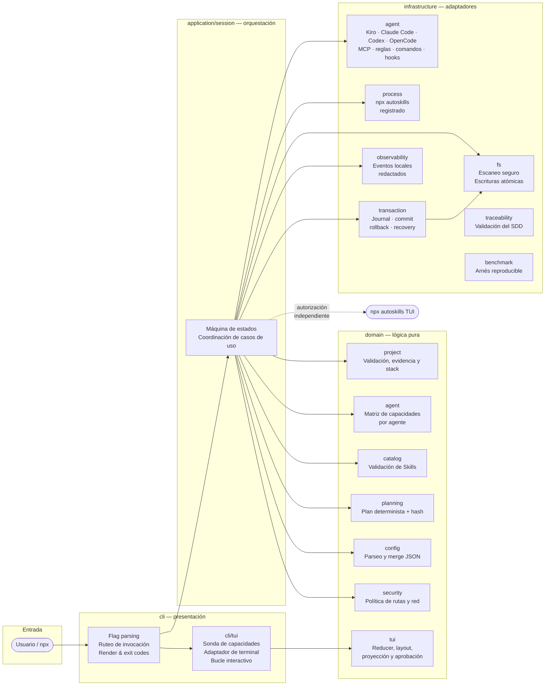

# auto-ai-setup

> **CLI local e interactiva para preparar proyectos para flujos de trabajo con agentes de IA.**

Analiza evidencia local, detecta el stack tecnológico, recomienda CLIs relacionadas y permite configurar servidores MCP, reglas de agente, slash commands, hooks y Skills mediante un plan determinista que requiere aprobación explícita antes de escribir cualquier archivo. Configura Kiro, Claude Code, OpenAI Codex y OpenCode, cada uno en su propia ruta oficial.

[](https://github.com/HeberYesid/auto-ai-setup/actions)
[](https://www.npmjs.com/package/auto-ai-setup)
[](LICENSE)

---

## 🎯 Demo y video

| Recurso                            | Enlace                                                |
| ---------------------------------- | ----------------------------------------------------- |
| **Video de presentación** | https://youtu.be/6mrmI47YVTs                     |

---

## ¿Qué problema resuelve?

Configurar un proyecto nuevo para trabajar con agentes de IA es un proceso manual y propenso a errores:

- Editar a mano `.kiro/settings/mcp.json`, `.mcp.json`, `.codex/config.toml`, `opencode.json`, `AGENTS.md`, `CLAUDE.md` y los directorios de comandos y hooks de cada agente, proyecto a proyecto
- Recordar el dialecto exacto de cada agente: Claude Code exige `type` en un servidor MCP remoto, OpenCode discrimina `local`/`remote` y usa `{env:VAR}`, Codex solo lee MCP desde TOML y reenvía variables con `env_vars`
- Buscar qué Skills existen y cuáles aplican al stack del proyecto
- Riesgo de sobrescribir configuraciones existentes sin backup ni rollback
- Sin plan visible ni aprobación explícita antes de aplicar cambios

### Agentes soportados

| Componente       | Kiro                              | Claude Code                | OpenAI Codex         | OpenCode                     |
| ---------------- | --------------------------------- | -------------------------- | -------------------- | ---------------------------- |
| Servidores MCP   | `.kiro/settings/mcp.json`         | `.mcp.json`                | `.codex/config.toml` | `opencode.json`              |
| Reglas de agente | `.kiro/steering/auto-ai-setup.md` | `CLAUDE.md`                | `AGENTS.md`          | `AGENTS.md`                  |
| Comandos slash   | `.kiro/prompts/<id>.md`           | `.claude/commands/<id>.md` | fase posterior       | `.opencode/commands/<id>.md` |
| Hooks            | `.kiro/hooks/<id>.json`           | `.claude/settings.json`    | `.codex/hooks.json`  | fase posterior               |
| Skills           | TUI externa `npx autoskills`      | TUI externa                | TUI externa          | TUI externa                  |

Se configuran los agentes cuya huella ya está en el proyecto (`.kiro/`, `.claude/`, `.codex/`, `opencode.json`…) y los cuatro cuando no hay ninguna.

**`auto-ai-setup` convierte esa preparación en un flujo local y explicable:**

```
evidencia del proyecto → stack confirmado → selección → plan verificable → aprobación → resumen
```

---

## Desarrollo local

```bash
git clone https://github.com/HeberYesid/auto-ai-setup.git
cd auto-ai-setup
corepack enable
pnpm install --frozen-lockfile
```

### Ejecutar localmente sin `npx`

Si `npx` no está disponible, o si quieres probar la versión del repositorio sin
publicarla en npm, compila primero el proyecto y ejecuta el archivo generado:

```bash
pnpm run build
node dist/cli/bin.js --path . --mode auto
```

También puedes anteponer `pnpm exec` al runtime de Node si quieres mantener la
invocación dentro del entorno de pnpm:

```bash
pnpm exec node dist/cli/bin.js --path . --mode auto
```

Para consultar la ayuda o ejecutar otros modos, reemplaza los argumentos del
último comando; por ejemplo:

```bash
node dist/cli/bin.js --help
node dist/cli/bin.js --path . --mode auto --json
```

El archivo `dist/cli/bin.js` se genera a partir del código fuente compilado, por
lo que hay que volver a ejecutar `pnpm run build` después de cambiar el código.
Estos comandos no publican el paquete ni requieren una instalación global.

## Inicio rápido (PROXIMAMENTE, actualmente solo disponible en local)

```bash
npx auto-ai-setup@0.1.0
```

No requiere instalación global. La CLI solicita el proyecto si no se indica `--path`, detecta el stack, presenta un plan y aplica los cambios únicamente tras aprobación explícita.

### Opciones disponibles

| Opción                | Descripción                                                                                                                       |
| --------------------- | --------------------------------------------------------------------------------------------------------------------------------- |
| `--path <ruta>`       | Proyecto objetivo; si se omite, se solicita interactivamente. Obligatorio en `--non-interactive`, `--json` y `--recover` sin TTY. |
| `--mode auto\|manual` | Fija el modo de selección; si se omite, la CLI lo solicita. `manual` exige una terminal interactiva.                              |
| `--verbose`           | Incluye evidencias de stack y decisiones de compatibilidad en los eventos.                                                        |
| `--recover`           | Busca y recupera una transacción incompleta del proyecto indicado.                                                                |
| `--no-animation`      | Presentación estática, sin animaciones.                                                                                           |
| `--non-interactive`   | No solicita nada; requiere `--path` y `--mode auto`. Previsualiza y no aplica nada.                                               |
| `--json`              | Como `--non-interactive` y escribe un único resumen JSON redactado en `stdout`.                                                   |
| `-h`, `--help`        | Muestra la ayuda de uso en `stdout`.                                                                                              |
| `-V`, `--version`     | Muestra la versión en `stdout`.                                                                                                   |

Cualquier argumento no listado se rechaza con código `2` y se imprime la ayuda en `stderr`.

`--mode manual` solo es válido con una terminal interactiva: en `--non-interactive` y `--json` la
selección componente por componente no se puede inferir, así que la ejecución termina con código `2`
y el motivo en el resumen. Usa `--mode auto` para automatizar.

## Ejemplos reproducibles

### Modo automático — proyecto existente

```bash
npx auto-ai-setup@0.1.0 --path . --mode auto
```

### Modo manual — con verbosidad

```bash
npx auto-ai-setup@0.1.0 --path . --mode manual --verbose
```

Requiere una terminal interactiva, porque la selección se hace componente por componente.

### Previsualización procesable (sin cambios)

```bash
npx auto-ai-setup@0.1.0 --path . --mode auto --json
```

Escribe un único resumen JSON redactado en `stdout` y no modifica el proyecto. El documento contiene
`status`, `exitCode`, `runId`, `applied`, `skipped`, `warnings`, `errors`, `manualReviewPaths` y,
cuando hubo recuperación, `recovery`. No incluye el plan ni su huella: el plan se revisa en la
ejecución interactiva, y su hash está ligado al `runId` y al instante de creación, así que identifica
una ejecución concreta y no es comparable entre ejecuciones. En CI sirve para comprobar el código de
salida, los avisos y los errores sin escribir nada en el proyecto.

## Requisitos previos

- Node.js 22 o superior
- `npx`, incluido con npm
- Terminal interactiva (TTY de entrada y salida) para aplicar cambios; los modos `--non-interactive` y `--json` funcionan en tuberías pero solo previsualizan
- Permisos de lectura y escritura sobre el proyecto objetivo
- Conexión de red únicamente si se autoriza abrir la TUI oficial `npx autoskills`

---


---

## Flujo de uso


---

## Arquitectura

El proyecto sigue arquitectura hexagonal por capas. La dirección de dependencias es `cli → application → domain`; la infraestructura implementa puertos tipados definidos hacia el interior.



---

## Capacidades del MVP

- Detecta tecnologías a partir de evidencia local sin enviar el proyecto a servicios remotos.
- Recomienda CLIs relacionadas con el stack (`gh`, `supabase`, `vercel`, `playwright`), pero no las instala ni ejecuta.
- Configura servidores MCP de workspace para los cuatro agentes en su ruta oficial, sin ejecutar los servidores.
- Escribe reglas de agente (`.kiro/steering/auto-ai-setup.md`, `CLAUDE.md`, `AGENTS.md`), comandos slash y documentos de hooks según lo que cada agente soporta.
- Edita `.codex/config.toml` como bloques de texto delimitados por marcadores: nunca se parsea como TOML y todo lo ajeno a los marcadores se preserva byte a byte.
- Preserva campos de configuración desconocidos y contenido ajeno a los cambios aprobados.
- Puede abrir, con autorización dedicada, la TUI oficial de `autoskills` para gestionar Skills de forma independiente.
- Ofrece modos procesables (`--non-interactive`, `--json`) que previsualizan el plan sin aplicar cambios.

---

## Uso de Kiro

`auto-ai-setup` fue desarrollado íntegramente usando **Kiro** como entorno de desarrollo asistido por IA. El proceso siguió un flujo **SDD (Spec-Driven Development)** completo:

### Spec mode — requisitos, diseño y tareas

Kiro Spec mode permitió formalizar el producto de forma incremental antes de escribir una línea de implementación:

| Artefacto    | Ubicación                                   | Descripción                                                                                   |
| ------------ | ------------------------------------------- | --------------------------------------------------------------------------------------------- |
| Requisitos   | `.kiro/specs/auto-ai-setup/requirements.md` | 15 user stories con 217 criterios de aceptación numerados                                     |
| Diseño       | `.kiro/specs/auto-ai-setup/design.md`       | Arquitectura, interfaces, modelos de datos, propiedades de corrección y estrategia de pruebas |
| Tareas       | `.kiro/specs/auto-ai-setup/tasks.md`        | 40+ tareas de implementación incrementales con dependencias explícitas                        |
| Trazabilidad | `.kiro/specs/auto-ai-setup/traceability.md` | Mapa bidireccional requisito ↔ propiedad ↔ test                                               |

Cada tarea generada por Kiro incluye qué implementar, qué probar y qué requisitos cubre, creando un ciclo completo de diseño → código → verificación.

### Steering — reglas persistentes del proyecto

Los archivos en `.kiro/steering/` guiaron todas las sesiones de desarrollo con restricciones no negociables:

- **`product.md`** — límites del producto: qué hace y qué no hace el MVP
- **`structure.md`** — estructura de directorios y dirección de dependencias
- **`tech.md`** — stack tecnológico, patrones de arquitectura y reglas de calidad

### Skills — capacidades especializadas

Se usaron las siguientes Skills de Kiro durante el desarrollo:

| Skill                       | Uso                                                                                  |
| --------------------------- | ------------------------------------------------------------------------------------ |
| `typescript-advanced-types` | Branded types, discriminated unions, Result types y utility types del dominio        |
| `vitest`                    | Configuración de cobertura, property-based testing con fast-check, fakes e inyección |
| `nodejs-best-practices`     | Patrones de async/await, manejo de errores, ESM y decisiones de arquitectura         |
| `nodejs-backend-patterns`   | Puertos y adaptadores, inyección de dependencias y separación de efectos             |

### Desarrollo asistido

- Implementación por capas respetando la dirección de dependencias en cada sesión
- Revisión de límites arquitectónicos: el dominio nunca importa infraestructura
- Generación y validación de 25 propiedades formales con fast-check
- Verificación continua contra los 217 criterios de aceptación del spec, validada por `pnpm run traceability` (217 requisitos, 930 referencias, 237 designaciones de cobertura)

---

## Impacto tecnológico

### El problema

| Situación actual                                                           | Consecuencia                                                                |
| -------------------------------------------------------------------------- | --------------------------------------------------------------------------- |
| Configurar MCP, reglas y Skills es manual en cada proyecto                 | Tiempo perdido, configuraciones inconsistentes entre proyectos              |
| No hay plan visible antes de aplicar cambios                               | Riesgo de sobrescribir configuraciones existentes sin forma de volver atrás |
| Los agentes de IA reciben contexto diferente según cómo configuró cada dev | Resultados impredecibles, difícil de reproducir                             |
| Integrar un dev nuevo a un workflow con agentes tarda horas                | Barrera de entrada alta, especialmente en educación                         |

### El impacto de `auto-ai-setup`

- **Equipos de desarrollo:** estandariza la configuración de agentes de IA en segundos, reproducible en cualquier máquina con `npx`
- **Educación:** reduce la barrera de entrada para estudiantes que quieren usar agentes de IA en sus proyectos
- **OSS:** un `npx auto-ai-setup` al clonar el repo prepara el entorno de cualquier contributor en menos de un minuto
- **Empresas:** política de configuración auditable: cada cambio queda en un plan con hash, aprobado por el desarrollador

---

## Innovación

### Diferenciadores frente a alternativas

| Característica                           | `auto-ai-setup` | Scripts manuales | Dotfiles/starters | `autoskills` solo |
| ---------------------------------------- | --------------- | ---------------- | ----------------- | ----------------- |
| Detección automática de stack            | ✅              | ❌               | ❌                | ❌                |
| Plan determinista con hash SHA-256       | ✅              | ❌               | ❌                | ❌                |
| Aprobación explícita antes de mutaciones | ✅              | ❌               | ❌                | ❌                |
| Transacción con rollback automático      | ✅              | ❌               | ❌                | ❌                |
| Idempotencia semántica                   | ✅              | ❌               | ❌                | Parcial           |
| Preserva configuración existente         | ✅              | ❌               | ❌                | ❌                |
| Redacción automática de secretos         | ✅              | ❌               | ❌                | ❌                |
| MCP + reglas + comandos + hooks          | ✅              | Manual           | Manual            | ❌                |
| Cuatro agentes en su ruta oficial        | ✅              | Manual           | Parcial           | ❌                |
| Arquitectura extensible por adaptadores  | ✅              | ❌               | ❌                | ❌                |

Determinismo del plan: para la misma evidencia y la misma selección, `auto-ai-setup` produce el mismo
conjunto ordenado y canonicalizado de cambios. La huella SHA-256 se calcula sobre ese plan más la
identidad de la ejecución, así que sirve para ligar la aprobación a un plan concreto, no para comparar
dos ejecuciones.

### Ventajas técnicas

- **Consentimiento como dato:** cada aprobación queda ligada al `planHash` SHA-256 de esa ejecución (incluye `runId` e instante de creación), no a una confirmación ambigua
- **Seguridad transaccional:** staging → backup → fsync → rename atómica → rollback inverso forman parte del flujo normal
- **Preservación semántica:** merge copy-on-write que solo toca campos gestionados, preservando todo lo demás
- **Recomendaciones sin efectos ocultos:** detectar una oportunidad no instala ni ejecuta nada
- **Límites explícitos:** la TUI externa de Skills se muestra como sistema independiente con su propio límite transaccional
- **25 propiedades formales** verificadas con fast-check (property-based testing) con mínimo 100 runs cada una

---

## Seguridad

### Fuente confiable para Skills

El MVP no mantiene un catálogo propio. La única fuente autorizada es la TUI oficial [`midudev/autoskills`](https://github.com/midudev/autoskills), invocada como `npx autoskills` **después de mostrar comando, propósito, uso de red y límite transaccional y recibir autorización explícita**.

---

## Licencia

Distribuido bajo la [licencia MIT](LICENSE). Copyright © 2026 Heber Yesid.
